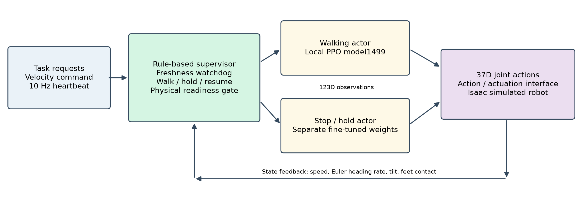
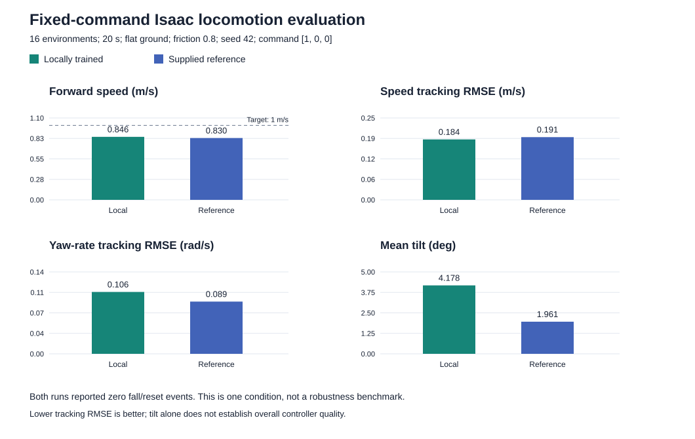
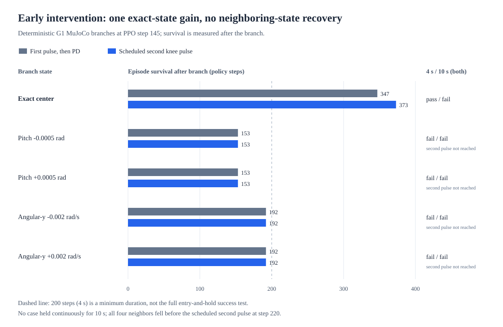
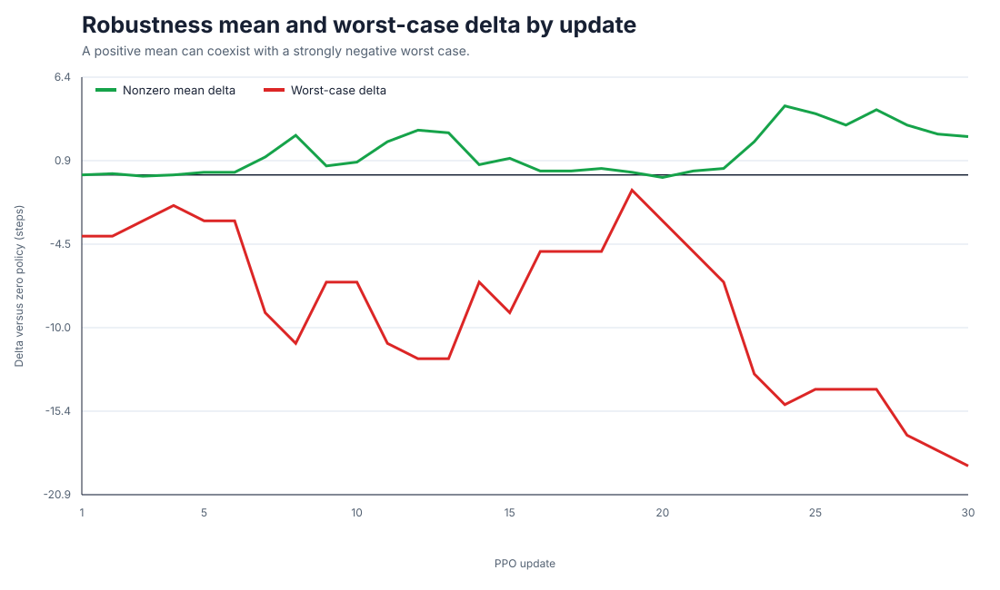
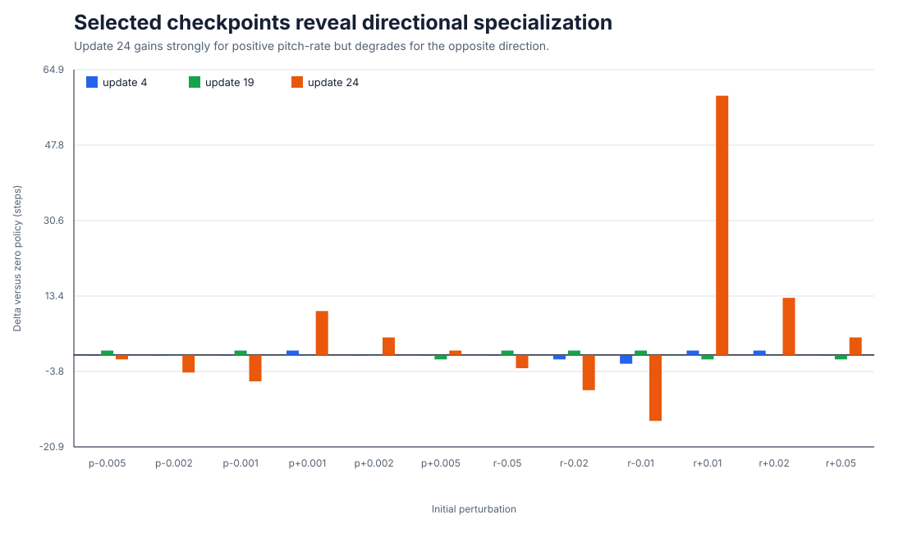

# Historical project overview

Preserved from the pre-cleanup README on 4 October 2026. Statements such as “current focus” below belong to their historical stages. For the present two-policy prototype, see the [current overview](../README.md). Inline paths and old commands are relative to the repository root. No experiment data or controller is changed by this documentation move.

# G1 Hierarchical Control & Robot Learning

## Overview

This project studies Unitree G1 humanoid control in Isaac and MuJoCo, combining locally trained PPO skills with explicit supervision, state-based handoffs and a task-message watchdog. A two-policy prototype executes walk → stop/hold → return-to-walk and handles simulated message loss. Controlled comparisons show that extra training or action blending can improve selected metrics while weakening transfer or skill integration.

## Key results

- Reproduced the reference walking workflow from random weights: 4,096 parallel environments, 1,500 PPO updates and 147,456,000 transitions; reference assets, task, rewards and PPO settings are attributed below.
- Fixed-policy handoff comparison: direct switching passed 48/48 low-speed sequences, action blending 43/48, and braking plus blending 37/48. Direct switching was selected before retesting.
- Held-out reset/entry-time evaluation: normal stop/resume, temporary message loss and persistent bounded holding each passed 108/108 cases. Scope: flat Isaac at 0.5 m/s; seeds vary world root pose, with no added disturbances. Persistent 12 s actor observation includes stopping; confirmed hold median 10.16 s.
- Independent reconstruction verified 318,455 first-episode actions. MuJoCo directional/stationary transfer, actual perception dropout and fallen-robot recovery remain open.



[Two-page research summary](../results/hierarchical_control/20261004/research_brief.pdf) · [Three-scenario synchronized demo](../results/hierarchical_control/20261004/three_scenarios.mp4) · [Verified retest protocol and results](../results/skills_sprint/20261004/sequence_retest/README.md) · [Research evidence chain](../results/hierarchical_control/20261004/evidence_chain.md)

The demo shows Isaac saved states rendered with MuJoCo geometry, with zero physics steps; it is not a MuJoCo dynamics validation. The supervisor uses explicit rules above separately parameterized walking and fine-tuned hold actors. Standalone skill acceptance remains distinct from sequence acceptance.


## Earlier milestone: task-to-skill interface demonstration

A simulation-first hierarchical interface now sequences measured goals:
walk 1 m, arc-turn by 0.4 rad, then walk 1 m, using the fixed locally trained
1499 locomotion actor. Task-message freshness, stage timeouts, watchdog events
and wall-clock timing are recorded. Normal and temporary-message-loss tasks
complete in 7.52 s; persistent loss aborts the simulation experiment at 5.22 s.
This is an interface/watchdog prototype, not validated stopping or recovery.
See the [three-scenario video, protocol and evidence](../results/hierarchical_demo/20261003/README.md).
The [handoff-point dropout comparison](../results/hierarchical_demo/20261003/handoff/README.md)
now verifies that an already-reached turn goal cannot advance until message
freshness is confirmed. The 0.68 s delay also exposes 5.4° excess turning
while retaining the previous command; stopping/recovery remains unvalidated.
An [independent nine-case command-response evaluation](../results/hierarchical_demo/20261003/command_response/README.md)
finds that immediate/ramped zero commands reduce travel but still drift:
about 1.05–1.13 m in 10 s. Neither response is promoted to stopping/fallback.
[Current-interface posture-hold probes](../results/hierarchical_demo/20261003/posture_hold/README.md)
then test captured/default joint poses with a continuous 0.50 s handoff.
All six posture holds fail the height check within 0.70–0.78 s; these
compatible 123D/37D candidates are excluded from fallback use.

## Locomotion baseline reproduction

A new locomotion policy was trained from random initialization using the
model, task and PPO configuration of
[g1_walk_isaaclab_mujoco](https://github.com/yezzzzye/g1_walk_isaaclab_mujoco).
Training used 4,096 parallel environments and 1,500 updates, collecting
147,456,000 transitions on an RTX 4060 Laptop GPU.

In one fixed-command Isaac evaluation across 16 environments for 20 seconds,
both the newly trained policy and the supplied reference baseline recorded
zero fall/reset events. Mean forward speeds were **0.846 m/s** and
**0.830 m/s**, respectively, against a 1 m/s command.



See the [experiment protocol, results and limitations](../results/locomotion_reproduction/README.md).
Continuous 20-second MuJoCo tests also avoided the evaluator's fall threshold,
but both policies developed heading drift. Directional MuJoCo transfer remains unresolved; the newer two-policy Isaac
supervisor is evaluated separately above.
A [passive locomotion monitor and six turning comparisons](../results/locomotion_shadow/README.md)
now include exact monitor-off/on trajectory checks for both exported actors
and yaw commands -0.2, 0 and +0.2 rad/s. The monitor only records signals.
[Offline window diagnostics](../results/locomotion_shadow/yaw_window/README.md)
explain two missed yaw candidates and distinguish body angular z from Euler
heading change, while synthetic slow oscillations expose false-alarm limits.
This reproduction complements, rather than replaces, the standing and
early-instability investigations below.

A hands-on research preparation project exploring robust humanoid control and robot learning using **Unitree G1**, **MuJoCo**, **Unitree SDK2**, **PD control**, and **reinforcement learning**.

The project develops progressively from low-level robot state/action interfaces to whole-body control, PPO-based learning, robustness evaluation, and hierarchical safety mechanisms.

## Earlier milestone: early-instability diagnosis

The G1 starts near an upright standing pose; this is a standing-and-recovery
study, not a floor get-up task. Under the frozen Day 9 MuJoCo configuration,
the optimized PD baseline lasts **215 policy steps**, while the best nominal
residual PPO checkpoint lasts **241 steps**. That PPO improvement does not
consistently generalize to tested nonzero pitch or pitch-rate perturbations.

Day 10 therefore audits the simulation, records matched failure trajectories,
and branches from identical MuJoCo states to measure recovery authority. At
one exact PPO-trajectory state, a scripted knee pulse followed by PD lasts
**347 steps after branching**; adding a timed second pulse lasts **373**.
Including their common 145-step prefix, these are **492** and **518 steps from
reset**. The second pulse is not a learned PPO recovery policy. In four tested
neighboring states, the robot falls before the second pulse's scheduled time;
no tested candidate achieves an uninterrupted 10-second hold.



See the [Day 10 result and reproduction notes](../results/day10/README.md),
[diagnostic summary](../notes/day10_diagnostics_summary.md), and the two short
[MuJoCo comparison videos](../media/videos/). The public CSV contains the
candidate-level measurements used to regenerate the figure; large state
trajectories and checkpoints remain local experiment artifacts.
The external Unitree model attribution is recorded in
[third-party notices](../THIRD_PARTY_NOTICES.md).

**Explore the project:** [Day 10 evidence](../results/day10/README.md) ·
[Day 9 figures](../results/day9/README.md) ·
[reusable control code](../src/g1_control/README.md) ·
[current scripts](../scripts/) ·
[experiment notes](../notes/)

---

Rather than treating reinforcement learning as an isolated component, the project focuses on the interaction between:

- robot state estimation,
- learned policies,
- low-level controllers,
- task and reward design,
- simulation dynamics,
- robustness,
- and safety/fallback mechanisms.

---

## Current Research Focus

The current focus is understanding **where humanoid standing and control failures originate across the full control stack**.

A failure observed in simulation may come from several different layers:

- policy learning,
- exploration and optimization,
- reward/task formulation,
- action representation,
- low-level PD control,
- contact dynamics,
- initial conditions,
- or the interface between these components.

The project therefore treats unsuccessful learning results as diagnostic evidence rather than simply continuing to optimize PPO hyperparameters.

The current research direction is moving from:

**low-level balance learning**

toward:

**hierarchical control → failure detection → safety intervention → fallback/recovery**

---

## Key Results So Far

### End-to-End G1 PPO Pipeline

A complete simulation learning loop has been implemented:

```text
G1 MuJoCo State
        ↓
64D Observation
        ↓
PPO Actor
        ↓
Bounded Policy Action
        ↓
Joint Target
        ↓
PD Controller
        ↓
Torque
        ↓
MuJoCo Physics
        ↓
Reward / Next State
        ↓
Rollout Buffer
        ↓
GAE
        ↓
PPO Update
```

The implementation includes:

- real G1 MuJoCo state extraction,
- 64D whole-body observations,
- bounded policy actions,
- joint-specific PD control,
- real rollout collection,
- Generalized Advantage Estimation,
- mini-batch PPO updates,
- GPU Actor/Critic training,
- checkpoint saving,
- deterministic evaluation,
- and baseline comparison.

---

### Residual PPO Improved Nominal Standing

The original 29D whole-body exploration problem was reformulated as a **6D lower-body residual-control problem** around an optimized PD standing baseline.

This substantially reduced the policy search space and allowed the learned policy to begin from an already meaningful controller.

Headline deterministic results:

| Policy / Checkpoint | Nominal Episode Length | Delta vs PD Baseline | Interpretation |
| --- | ---: | ---: | --- |
| Optimized PD zero policy | 215 | — | fixed baseline |
| Original residual PPO, update 1 | 241 | +26 | improved nominal standing |
| Randomized PPO, update 4 | 232 | +17 | nominal improvement, no nonzero mean robustness gain |
| Randomized PPO, update 19 | 200 | -15 | best observed worst-case disturbance result |
| Randomized PPO, update 24 | 150 | -65 | directional specialization |

The result is important because the learned controller **did improve nominal standing**, but increased training did not automatically produce general robustness.

---

### Robustness Remains Unsolved



**Key observation.** Mean disturbance performance can improve while the
worst-case outcome simultaneously deteriorates. This suggests that optimizing
average behaviour alone is insufficient for robust humanoid control and
motivates the next-stage supervisory safety and fallback layer.



Selected checkpoints also reveal directional specialization: a policy may
learn a strong correction for one perturbation direction while becoming less
effective for the opposite direction.

The policy was evaluated under:

- nominal initialization,
- coarse pitch disturbances,
- near-zero pitch disturbances,
- pitch-rate disturbances,
- randomized initial conditions,
- and checkpoint-wide robustness sweeps.

The current conclusion is:

> Residual PPO improved nominal standing and later learned direction-specific corrective behaviour, but no checkpoint demonstrated consistent symmetric robustness across all tested nonzero perturbations.

This marks a useful research boundary.

The current bottleneck is no longer simply:

> “Can PPO be implemented and connected to G1?”

Instead, the questions are increasingly about:

> control structure, disturbance handling, robustness, controller interaction, and safety.

---

# Project Progression

## Day 1 — Environment and Simulation

- Unitree SDK2
- MuJoCo
- `unitree_mujoco`
- Unitree G1 29-DoF simulation
- WSL2 robotics development environment

Documentation:

`notes/day01_environment.md`

---

## Day 2 — State / Action Interface

Established the low-level robot state interface and MuJoCo ↔ Unitree mapping.

Topics implemented or investigated:

- joint position `q`,
- joint velocity `dq`,
- `LowState`,
- actuator and sensor mapping,
- Unitree SDK2 bridge,
- G1 joint indexing,
- floating-base state,
- quaternion representation,
- and simulator/state mapping.

Documentation:

`notes/day2_state_action_interface.md`

---

## Day 3 — PD Joint Tracking

Implemented the first closed-loop control experiment.

Key components:

- `LowState` subscriber,
- `LowCmd` publisher,
- 500 Hz control loop,
- left-knee PD tracking,
- controlled target displacement,
- `Kp` comparison,
- CSV logging,
- quantitative tracking plots,
- and feedback-control analysis.

This stage established the basic loop:

```text
Target
   ↓
Tracking Error
   ↓
PD Controller
   ↓
Command / Torque
   ↓
Robot Dynamics
   ↓
State Feedback
```

Documentation:

`notes/day3_pd_joint_tracking.md`

Results:

`results/day3/`

---

## Day 4 — Whole-Body Policy Interface

Expanded from single-joint control to a whole-body state/action representation.

Current observation:

```text
29 joint positions
+ 29 joint velocities
+ 3 RPY
+ 3 angular velocities
= 64D observation
```

Implemented:

- 64D whole-body observation,
- joint state + IMU integration,
- 29D relative action vector,
- multi-joint scripted policy,
- policy → target → PD hierarchy,
- and whole-body policy interface.

Documentation:

`notes/day4_whole_body_policy_interface.md`

---

## Day 5 — Hierarchical Whole-Body Control Foundations

Investigated the relationship between joint-space control and higher-level task-space control.

Topics include:

- coordinated hip–knee–ankle motion,
- joint space vs task space,
- forward kinematics,
- inverse kinematics,
- Jacobians,
- task-space velocity control,
- singularities,
- pseudoinverse control,
- redundancy,
- null-space behaviour,
- and task-priority hierarchical control.

Documentation:

`notes/day5_hierarchical_whole_body_control.md`

---

## Day 6 — Reinforcement Learning Foundations

Built the theoretical foundation required for policy learning.

Topics include:

- reward and return,
- state value `V(s)`,
- action value `Q(s,a)`,
- advantage,
- Bellman recursion,
- bootstrapping,
- TD error,
- Actor–Critic,
- Generalized Advantage Estimation,
- Policy Gradient,
- PPO clipping,
- rollout / batch / mini-batch / epoch,
- and on-policy learning.

The emphasis was on mapping each RL concept directly to the G1 + MuJoCo control problem.

Documentation:

`notes/day6_reinforcement_learning_foundations.md`

---

## Day 7 — PPO Core Implementation

Implemented the PPO algorithm independently from the real G1 environment before simulator integration.

Components include:

- Actor network,
- Critic network,
- Gaussian policy,
- learnable `log_std`,
- RolloutBuffer,
- detached rollout storage,
- GAE,
- value targets,
- PPO probability ratio,
- clipped surrogate objective,
- Actor loss,
- Critic loss,
- entropy regularization,
- shuffled mini-batches,
- multiple PPO epochs,
- and end-to-end update sanity testing.

Pipeline:

```text
Observation
    ↓
Actor / Critic
    ↓
Gaussian Action
    ↓
Rollout Buffer
    ↓
GAE
    ↓
PPO Update
    ↓
Updated Actor / Critic
```

Documentation:

`notes/day7_PPO_core_implementation.md`

Implementation:

`code/day7/g1_ppo/`

---

## Day 8 — G1 / MuJoCo PPO Integration

Integrated PPO with the real G1 MuJoCo simulation.

Verified model properties:

- `nq = 36`
- `nv = 35`
- `nu = 29`
- physics timestep = `0.002 s`

Implemented:

- real 64D G1 observations,
- quaternion → RPY conversion,
- 29D policy action interface,
- `tanh`-bounded actions,
- standing reference pose,
- joint-specific PD gains,
- action → `q_target` → PD → torque,
- 500 Hz physics,
- 50 Hz policy execution,
- environment reset,
- reward computation,
- termination and truncation,
- zero-action PD baseline,
- Actor → G1 integration,
- MuJoCo Viewer integration,
- real rollout collection,
- real GAE,
- PPO optimization,
- checkpoint saving,
- and deterministic evaluation.

Initial repeated PPO experiment:

```text
40,960 environment transitions

Rollout size: 2048
Mini-batch size: 128
PPO epochs: 3

Actor learning rate: 1e-4
Critic learning rate: 3e-4
Initial log_std: -1.0
Entropy coefficient: 0.001
```

Initial deterministic evaluation:

| Policy | Episode Length | Return | Max \|Pitch\| | Min Height |
| --- | ---: | ---: | ---: | ---: |
| Zero-action PD | 52 | 98.54 | 0.814 | 0.599 |
| Untrained Actor | 52 | 98.48 | 0.814 | 0.598 |
| Trained Actor | 52 | 98.49 | 0.813 | 0.599 |

This experiment showed that the PPO–G1 training pipeline itself was functioning, but the original task formulation did **not** produce an effective standing correction policy.

That result motivated the Day 9 redesign.

Documentation:

`notes/day8_g1_ppo_integration.md`

Implementation:

`code/day8/g1_ppo/`

---

## Day 9 — Residual PPO Balance and Robustness

Day 9 reformulated the control problem rather than continuing to tune the original PPO system.

Changes included:

- calibrated standing pose,
- joint-specific PD baseline,
- reduction from 29D exploration to a 6D lower-body residual policy,
- zero-initialized Actor output layer,
- training initialized at the PD baseline,
- fixed `log_std = -3`,
- separate Actor/Critic learning rates,
- deterministic checkpoint selection,
- experiment provenance,
- nominal evaluation,
- disturbance evaluation,
- randomized reset training,
- and checkpoint-wide robustness sweeps.

Training used:

```text
30% nominal initial states
70% randomized initial states
```

All 30 checkpoints were evaluated across 12 nonzero near-zero perturbation cases.

Headline results:

| Policy / Checkpoint | Nominal Length | Delta vs Zero | Robustness Interpretation |
| --- | ---: | ---: | --- |
| Optimized PD zero policy | 215 | — | fixed baseline |
| Original residual PPO, update 1 | 241 | +26 | nominal improvement |
| Randomized PPO, update 4 | 232 | +17 | no nonzero mean gain |
| Randomized PPO, update 19 | 200 | -15 | least-negative worst case |
| Randomized PPO, update 24 | 150 | -65 | directional specialization |

Current conclusion:

> Residual PPO improved nominal standing and produced some direction-specific corrective behaviour, but no checkpoint demonstrated consistent symmetric robustness across the complete disturbance set.

This result motivates the next stage: adding a **hierarchical supervisory layer** rather than continuing open-ended low-level PPO optimization.

Documentation:

`notes/day9_residual_ppo_robustness.md`

Implementation:

`code/day9/g1_balance/`

Results and figures:

`results/day9/`

---

# Current Control Architecture

```text
64D Whole-Body State
        ↓
6D Residual PPO Policy
        ↓
Standing Pose
+ Bounded Joint-Target Correction
        ↓
29D Target q
        ↓
Joint-Space PD Controller
        ↓
Torque-Clipped MuJoCo G1
        ↓
Whole-Body Feedback
```

The learned controller therefore does **not** directly output actuator torque.

Instead, learning occurs above the low-level PD controller through bounded corrections to joint targets.

---

# Active Code Layout

The repository preserves the original day-by-day experimental progression while separating reusable implementation from historical experiments.

```text
src/g1_control/
    reusable environment, learning, training,
    evaluation, and controller components

scripts/
    current runnable training and evaluation entrypoints

code/
    day-by-day implementation and experiment history

notes/
    technical notes and learning/research documentation

results/
    committed quantitative summaries and figures

media/
    experiment recordings and visual material
```

This structure allows later stages to add supervisory control, watchdogs, and fallback behaviour without duplicating the lower-level implementation.

---

# Day 10 — Hierarchical Safety and Early-Recovery Diagnosis

Day 9 closed open-ended nominal PPO tuning at a documented experimental
boundary. Day 10 has added a controller interface and watchdog that can detect
unsafe states and switch from PPO to PD. Boundary tests show that this switch
does **not** by itself prevent a fall. The subsequent environment audit,
matched trajectories, exact-state branches, and five-state intervention
comparison test where the existing action space has useful control authority.

The longer-term supervisory structure is:

```text
High-Level Command / Skill
        ↓
Controller Interface
        ↓
PD / Residual PPO / Future Skill Executor
        ↓
Watchdog / Failure Detection
        ↓
Safety Decision
        ↓
Recovery / Fallback
        ↓
G1
```

Further experiments may include:

- control and inference latency,
- observation dropout,
- disturbance detection,
- controller health monitoring,
- safety intervention timing,
- fallback activation,
- recovery behaviour,
- and recovery success rate.

A compatible pretrained G1 locomotion or control policy may later be added behind the same controller interface. No pretrained policy has currently been selected.

The immediate research gate is to demonstrate a reproducible region of
early-state braking, return to a standing envelope, and sustained hold before
promoting any scripted intervention to a recovery controller or extending the
task toward weight shifting and walking.

---

# Longer-Term Direction

The longer-term direction is **Physical / Embodied AI with Safety and Reliability**.

The planned control progression is stable standing and early recovery, then
weight shifting, a single step with a stable post-step hold, repeated stepping,
velocity-conditioned control, and continuous walking. Locomotion rewards and
larger action spaces are deferred until the standing/recovery reference is
well characterized; standing can later be the zero-command case of locomotion.

The intended progression is:

```text
Low-Level Control
        ↓
Hierarchical Control
        ↓
Skill-Level Policies
        ↓
Safety / Recovery
        ↓
Vision / Language / Memory
        ↓
Planning / World Models
        ↓
Sim-to-Real Embodied Intelligence
```

The design principle is that higher-level AI systems should produce:

- skills,
- goals,
- poses,
- velocities,
- plans,
- or recovery requests,

while low-level safety-critical execution remains mediated by structured controllers and safety mechanisms.

The project is therefore gradually moving from:

**“Can the robot learn a control policy?”**

toward:

**“How should an embodied system decide, act, detect failure, and recover safely across multiple levels of control?”**

---

## Getting started and reproducing the public figure

The current scripts have been run with Python 3.12 on Ubuntu/WSL2. From the
repository root, create a virtual environment and install the core Python
dependencies:

```bash
python3 -m venv .venv
source .venv/bin/activate
python3 -m pip install numpy mujoco torch
```

The simulator also needs the external [Unitree MuJoCo model](https://github.com/unitreerobotics/unitree_mujoco).
The current environment looks for
`~/robotics/unitree_mujoco/unitree_robots/g1/scene_29dof.xml`; the model files
are not included here. With that scene in place, a short PD-only check is:

```bash
python3 scripts/run_controller_smoke.py --mode pd_stand --steps 10
```

The Day 10 figure can be regenerated without MuJoCo, the model, or a policy
checkpoint:

```bash
python3 scripts/generate_day10_evidence.py
```

It reads the committed summary CSV and writes the figure and plotted summary
in `results/day10/`. Replaying PPO evaluations or the exact branch experiment
requires the matching local checkpoint and saved simulator states, which are
not distributed in this repository; see the [evidence limitations](../results/day10/README.md).
The historical `scripts/plot_knee_comparison.py` additionally requires
`pandas` and `matplotlib`.
