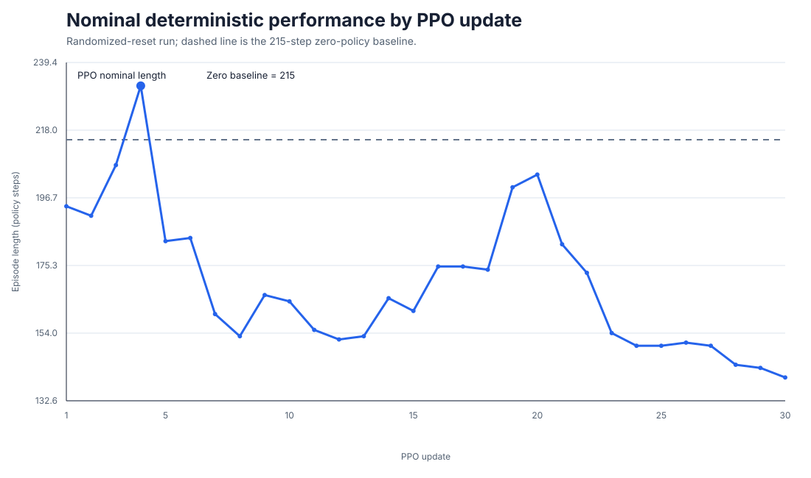
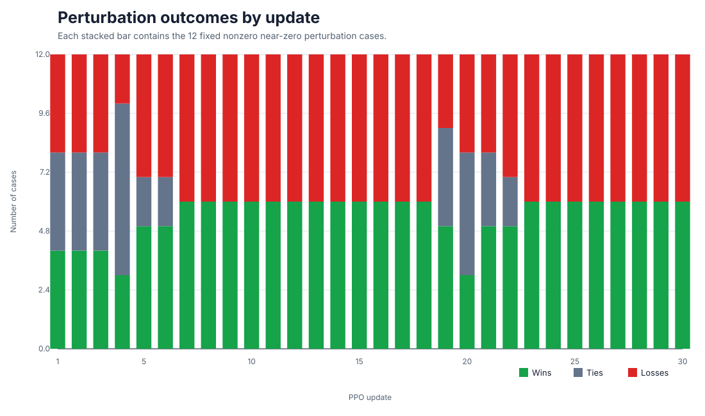

# Day 9 — Residual PPO Balance and Robustness

## Scope

Day 9 turns the Day 8 PPO integration into a controlled balance experiment.
The objective is not to claim a general humanoid locomotion policy. It is to
measure whether a 6D lower-body residual policy can improve a calibrated PD
standing baseline and whether that improvement generalizes to nearby initial
pitch and pitch-rate disturbances.

The final control path is:

```text
64D observation
    ↓
6D residual PPO policy
    ↓
standing pose + 0.15 × bounded residual
    ↓
29D target joint vector
    ↓
joint-space PD
    ↓
torque-clipped MuJoCo G1
```

## Frozen experiment configuration

### State and action

```text
Observation: 29 q + 29 dq + 3 RPY + 3 base angular velocity = 64D
Action:      6D
Joints:      left/right hip pitch, knee, ankle pitch
Action scale: 0.15 rad
Policy rate:  50 Hz
Physics rate: 500 Hz
```

### Standing reference and PD gains

```text
Pose: hip -0.16, knee +0.23, ankle -0.07 rad

Hip:   Kp 100, Kd 2
Knee:  Kp 150, Kd 4
Ankle: Kp 40,  Kd 2
```

### PPO

```text
Actor output head: zero initialized
log_std:            -3, fixed
entropy coefficient: 0
actor learning rate:  4e-5
critic learning rate: 3e-4
rollout steps:         2048
PPO epochs:            3
mini-batch size:       128
seed:                  42
```

Episodes terminate when height falls below 0.45 m, absolute roll or pitch
exceeds 0.8 rad, or the episode reaches 1000 policy steps.

## Baseline calibration

Pose and PD sweeps improved the deterministic zero-residual standing result
from approximately 50 steps to:

```text
Optimized PD zero policy: 215 steps
```

This 215-step controller is the fixed reference for the PPO comparisons.

## Original nominal residual PPO

The original residual PPO run used deterministic environment resets. Its
deterministic winner was:

```text
Checkpoint: checkpoints/best_deterministic.pt
Update:     1
Steps:      2048 environment transitions
Length:     241 policy steps
Delta:      +26 steps (+12.1%) versus zero policy
```

This establishes a real nominal proof of concept: a learned residual can
outperform the calibrated PD standing baseline on the unperturbed trajectory.

The same policy did not improve any of the 12 nonzero coarse pitch and
pitch-rate cases. Nominal improvement therefore did not establish robust
feedback or a larger stability basin.

## Randomized-reset experiment

Training was repeated with:

```text
30% nominal resets
70% randomized resets
initial pitch:      uniform in [-0.005, +0.005] rad
initial pitch-rate: uniform in [-0.05, +0.05] rad/s
```

All other frozen PPO and controller parameters remained unchanged. A 5-update
pilot and a 30-update run were executed. Because the seed and configuration
were identical, the first five updates of the longer run reproduce the pilot.

The best deterministic nominal checkpoint remained update 4:

```text
Randomized update 4: 232 steps
Delta versus zero:   +17 steps
```

Later updates did not improve the nominal result. Update 30 reached only 140
steps, showing policy degradation under continued optimization.

## Checkpoint-wide robustness sweep

Every checkpoint from update 1 through update 30 was evaluated on one nominal
case and 12 fixed nonzero near-zero perturbations. Deterministic evaluation
uses the Gaussian actor mean followed by `tanh`.

Three checkpoints summarize the result:

### Update 4 — nominal winner

```text
Nominal:             232 (+17)
Nonzero mean delta:  +0.00
Worst delta:         -2
Wins / ties / losses: 3 / 7 / 2
```

Update 4 improves the unperturbed trajectory but produces no aggregate
nonzero robustness improvement.

### Update 19 — most balanced trade-off

```text
Nominal:             200 (-15)
Nonzero mean delta:  +0.17
Worst delta:         -1
Wins / ties / losses: 5 / 4 / 3
```

Update 19 has the least-negative worst case, but it gives up nominal
performance and still loses in three perturbation cases. It is a useful
diagnostic checkpoint, not a robust winner.

### Update 24 — directional specialization

```text
Nominal:             150 (-65)
Nonzero mean delta:  +4.50
Worst delta:         -15
Wins / ties / losses: 6 / 0 / 6
```

Its positive average is dominated by asymmetric behavior. For an initial
pitch-rate of +0.01 rad/s it improves from 148 to 207 steps (+59), while at
-0.01 rad/s it drops from 149 to 134 steps (-15). Positive and negative
perturbations do not receive symmetric recovery behavior.

No checkpoint achieves a nonnegative worst-case delta across all 12 nonzero
cases. Later positive mean scores therefore do not demonstrate a uniformly
expanded stability basin.

## Figures







## Scientific conclusion

> Residual PPO improved nominal standing and later learned direction-specific
> corrective behavior, but no checkpoint demonstrated consistent symmetric
> robustness across all nonzero perturbation cases.

This is not a failed implementation. The PPO pipeline works, the nominal
effect is measurable, and randomized training changes the policy. The result
instead identifies a robustness/generalization limitation in the current task
formulation.

## Reproduction

From `code/day9/g1_balance` with the project virtual environment active:

```bash
python3 train_balance.py

G1_CHECKPOINT_DIR=/absolute/path/to/run python3 evaluate_balance.py
G1_CHECKPOINT_DIR=/absolute/path/to/run python3 evaluate_robustness.py

python3 evaluate_local_robustness.py \
  --checkpoint /absolute/path/to/run/best_deterministic.pt

python3 evaluate_checkpoint_robustness_sweep.py \
  --checkpoint-dir /absolute/path/to/run
```

Calibration and diagnostic utilities are documented in
`code/day9/g1_balance/tools/README.md`.

Checkpoints and raw per-step traces remain local experiment artifacts. The
repository contains the compact CSV/JSON summaries and figures required to
inspect the published result without committing all model binaries.

## Milestone boundary

Day 9 is complete at:

```text
Low-level Residual PPO Research Baseline — Frozen
```

The next project stage is not another open-ended PPO sweep. It is the missing
middle layer of the original project plan:

```text
high-level command / skill
    ↓
controller interface
    ↓
watchdog and failure detection
    ↓
recovery / fallback
    ↓
PD, residual PPO, or a future compatible pretrained skill executor
```

Latency, observation dropout, disturbance handling, intervention rate, and
recovery success become the next quantitative evaluation targets.
