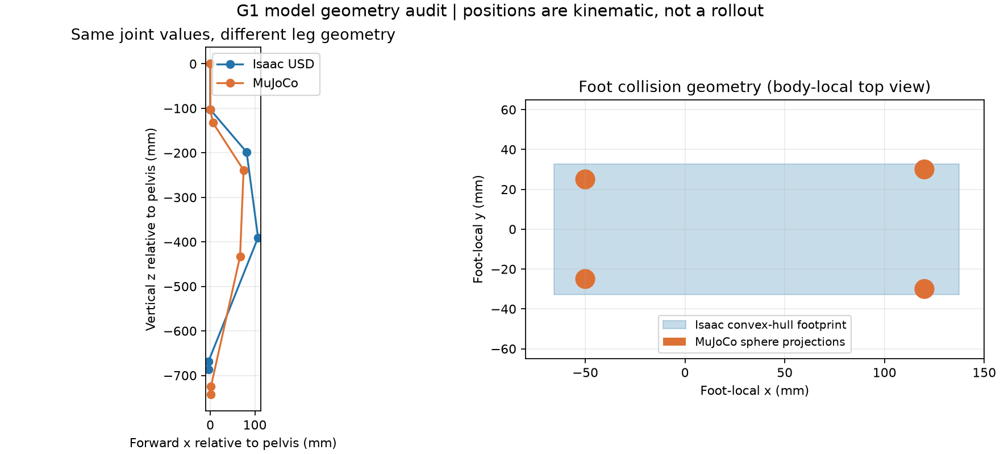

# USD / MuJoCo 模型几何核验

已完成 37 个动作关节的轴、参考零位、默认姿态、质量/质心/惯性张量及双脚碰撞几何检查。固定 model_1499；本轮未训练、修改参考资产或部署配置，也未 commit/push。

**主要发现：数字接口一致，但两套机器人模型并不等价。**

## 关节轴与参考姿态

全部 37 个关节在各自子部件坐标中的转轴方向一致，夹角 0°，未发现轴反向。
然而，“相同关节角”不是“相同身体姿态”：USD 的髋 pitch 参考零位相对 MuJoCo 偏转约 20°。
在原始零关节数值下，部分世界/骨盆坐标转轴夹角最大 9.979°，关节锚点位置差最大 58.641 mm。
这些结果包含模型固定变换与零位差异，不能把世界轴夹角直接称为关节接反。

将同一份 metadata 默认关节角分别代入两套原始模型后：

| 部件 | 原点距离差 | 姿态旋转差 |
|---|---:|---:|
| 左/右髋 pitch | 0.002 mm | 20.000° |
| 左/右膝 | 58.641 mm | 9.198° |
| 左/右脚 ankle roll | 56.708 mm | 0° |

距离均为三维欧氏距离，不能直接理解为水平落脚偏差。
详见 [关节表](joint_frames.csv) 和 [默认姿态/质量表](body_default_pose_and_mass.csv)。

## 质量、质心与惯量

USD 原始质量和约 32.239 kg；MuJoCo 编译模型总质量约 34.394 kg。
这是资产/编译模型核验，不是本轮重新采样的 PhysX 运行时质量。
固定链接的合并方式存在差异，因此非一一对应部件的质量不可直接用作校准目标。
下列骨盆和腿部质量已显示明确差异：

| 部件 | USD 原始质量 kg | MuJoCo kg |
|---|---:|---:|
| 骨盆 | 2.860 | 3.814 |
| 单侧髋 pitch | 1.299 | 1.350 |
| 单侧膝 | 2.252 | 1.932 |
| 单侧脚 ankle roll | 0.391 | 0.608 |

骨盆局部质心位置仅差约 0.020 mm；髋 pitch 局部质心差约 25.182 mm。
惯性主轴先转换为完整的部件局部惯性张量后比较，避免仅比较排序不同的主惯量；结果保存在部件表。
没有把这些差异逐项“调到一样”，也没有认定某一差异是当前偏航的主因。

## 双脚碰撞

Isaac 原始 USD 每只脚为一个凸包碰撞网格，脚局部范围约：
`x=[-65.638,137.472] mm, y=[-32.735,32.735] mm, z=[-34.424,-15.916] mm`。
MuJoCo 每只脚为四个半径 5 mm 的接触球，联合范围：
`x=[-55,125] mm, y=[-35,35] mm, z=[-35,-25] mm`。
上图显示凸包的几何投影与球的投影，不能将投影面积当成实际承压接触面积。

左右脚各自的局部范围相同；没有发现左脚和右脚尺寸配置不一致。
USD 机器人只有 3 个原始启用碰撞 prim：双脚与 torso；MuJoCo 有 52 个机器人接触 geom，另有 1 个地面 geom。
Isaac 配置关闭机器人自碰撞；MuJoCo 使用各自的接触过滤设置。碰撞几何数目不等于运行中的实际接触对数目。
详情见 [足部几何](feet.json)。上一轮右踝受力更大的原因仍未定位。

## 验证与范围

直接读取原始 USD 的父/子关节局部坐标，重建 37 个转动关节及 6 个固定关节，覆盖全部 44 个身体。
原始 USD 零位重建位置误差最大 0.121 µm。
再用现有 Isaac 真实回放的关节角，在 0、1、2、4、8 秒重建全身姿态，并转换到实际骨盆坐标：
最大位置误差约 1.516 µm，旋转矩阵元素最大误差约 1.508e-6。
这项实际轨迹校验确认了 USD 关节正方向、零位与图中正运动学的解释。

MuJoCo 读取上一轮实际回放保存的有效编译模型，比较阶段只运行 `mj_forward`，没有物理步进。
基座坐标统一为骨盆原点，+X 前方、+Z 上方；资产单位为米，四元数为 wxyz。
来源、资产与编译模型哈希、USD 提取结果、数字核验与图保存于本目录；不复制原始网格资产。
独立运行标准和 `python -O` 分析均通过；几何图已人工检查。

最初经 Isaac AppLauncher 的读取尝试未保存结果，另一次严格 JSON 输出遇到 USD 默认 `-inf` 自动属性。两次均未纳入证据。
成功读取使用已有 Isaac USD 库独立加载，不需要 Vulkan 或启动仿真；非有限默认属性显式保存为字符串，未当作实际坐标使用。

下一步应先建立几何与零位一致的独立 MuJoCo 对照模型，并验证同关节角下的全身姿态，再进行固定策略、单变量动力学比较。
在几何不一致的原始模型上继续增加 PPO 迭代，尚无证据能解决迁移。此次未宣称行走/转向已经修复。
