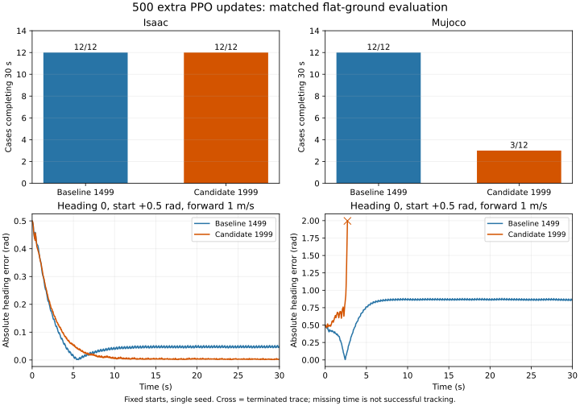

# Flat continuation evaluation: model1499 versus model1999

Completed2October2026:24Isaac cases +24MuJoCo cases, plus one independent
MuJoCo failure repeat. **Do not promote model1999 as the Sim2Sim baseline.**
Originalmodel1499 remains the comparison checkpoint; its MuJoCo heading
quality is still insufficient for a validated directional walking baseline.

## Matched task

Each actor runs12conditions: forward0.5/1m/s, constant yaw0/-0.2/+0.2rad/s,
and target heading0/-pi/2/+pi/2 using the reference feedback
clip(0.5*wrapped heading error,-1,1). Heading0 starts at+0.5rad.
Requested30s, plane, seed42. Isaac:16fixed-start parallel environments,
physics5ms/policy20ms, static/dynamic friction0.8/0.6, no observationnoise
or random standing. MuJoCo:physics1ms/policy20ms, friction0.8, original
model/actor mapping/PD. No resets are counted as further successful walking.
Parallel environments and fixed plane conditions are not independent seeds.

## Outcome

| Engine | Model | Cases completing30s | Physical termination |
| --- | --- | ---: | ---: |
| Isaac | Baseline1499 |12/12|0of192env-case episodes|
| Isaac | Candidate1999 |12/12|0of192env-case episodes|
| MuJoCo | Baseline1499 |12/12|0cases|
| MuJoCo | Candidate1999 |3/12|9cases|

Across the same12complete Isaac cases, mean forward RMSE changes from
0.10370to0.06409m/s. Across6heading cases, mean absolute finalheading
error changes0.02800to0.00304rad. Mean worldyaw-rate RMSE across12cases
changes0.06426to0.06896rad/s, so improvement is not uniform across metrics.
These are equally weighted case means, not independent robustness estimates.

Candidate MuJoCo failures occur at2.28–8.92s:all6forward1m/s cases and
all3forward0.5heading-feedback cases fail. The three surviving0.5fixed-rate
cases have mean worldyaw rates-0.975,-1.157,-0.711rad/s for commands
0,-0.2,+0.2. They complete time but have poor tracking. Failed cases'
RMSE and heading endpoints are truncated, not successful30s task scores.
The comparison CSV suppresses tracking deltas when either run is incomplete;
aggregated candidate MuJoCo metrics use only3survivors and must not be
compared with baseline12-case averages.



Bottom panels show the fixed1m/s targetheading0 task; crosses end at failure.
The result is improved Isaac task tracking with a material MuJoCo transfer
regression in this one continuation experiment, not proof that additional
PPOtraining generally harms transfer.

## Evidence

- All8exported weight/bias arrays match model1999 exactly. TorchScript/NPZ
  inference on64seeded inputs agrees within max absolute2.384e-6.
- Checkpoint1999 SHA-256 matches trainingcomplete manifest.
- Oldmodel1499 replays all12Isaac cases with exactly equal numeric metrics
  and saved arrays, and all12MuJoCo cases with exactly equal metrics and
  trajectory CSV bytes versus pre-training runs. Evaluator changes add only
  comparison checkpoint/policy and label arguments; scoring/control unchanged.
- Independent analysis verifies all48case traces' actual commands and initial
  headings. Isaac heading matches recorded rootquaternion; valid flags exclude
  post-reset scoring; speed/yaw metrics are independently recomputed.
- Unmodified reference run_grid.run_once independently repeats candidate
 1m/s zero-yaw failure at2.6s with identical raw metrics, without command or
  initial-heading hooks. The first attempt using an older recorder stopped
  before simulation because it assumed policy paths inside the reference repo;
  that failed attempt is retained locally and excluded from evidence.
- Original inputs unchanged after both complete suites. Pre-run hashes, runtime,
  command protocols, export audit and48proofs are archived. Source snapshot
  copies stored locally match the pre-run hashes; copies were taken after runs.

analysis.json /comparison.csv contain complete outcomes and verification.
continuation_state_audit.json documents that optimizer loading is not exact
algorithm/RNG/simulator-state continuation:the adaptive algorithm learningrate
is initialized from config at restart, following the reference runner.
No causal explanation is claimed from this observation. The staticinterface
audit remains a list of discrepancies, not an established cause.

## Decision and next work

Keep1499as the frozen experimental comparison; retain1999as an Isaac
continuation candidate and transfer-failure diagnostic, not the deployed
Sim2Simbaseline. Do not start another blind continuation or roughPPOtrain.
Next:with frozen1499, audit rootframe/observation and action contracts,
joint axes/defaults and dynamic model/contact/actuator differences; change
one justified variable per comparison. Do not enlarge torque limits merely
to make transfer pass. A display-ready flat controller and baseline acceptance
remain pending. Hierarchical switching/fallback remain deferred.

## Reproduce

Use a NEWoutputdirectory, explicit actorlabels and the originalcheckpoint:

```bash
bash scripts/run_flat_isaac.sh scripts/evaluate_flat_commands_isaac.py \
 --headless --reference-root /home/omai/robotics/reference_projects/g1_walk_isaaclab_mujoco \
 --comparison-checkpoint /path/to/original/model_1499.pt \
 --local-checkpoint /path/to/candidate/model_1999.pt \
 --comparison-label baseline1499 --local-label candidate1999 \
 --num-envs 16 --duration 30 --output-dir /path/to/NEWisaac
OPENBLAS_NUM_THREADS=1 OMP_NUM_THREADS=1 .venv/bin/python scripts/evaluate_flat_commands_mujoco.py \
 --reference-root /home/omai/robotics/reference_projects/g1_walk_isaaclab_mujoco \
 --comparison-policy /path/to/original/policy_actor.npz \
 --local-policy /path/to/candidate/policy_actor.npz \
 --comparison-label baseline1499 --local-label candidate1999 \
 --duration 30 --output-dir /path/to/NEWmujoco
```

Full traces/logs/exported weights stay in the ignored project directory
code/day9/g1_balance/checkpoints/flat_baseline/20261002/. Model/checkpoint
weights are not redistributed in this summary. No reference source or
standing diagnostic changes, newtraining, roughterrain, switching, commit/push.
