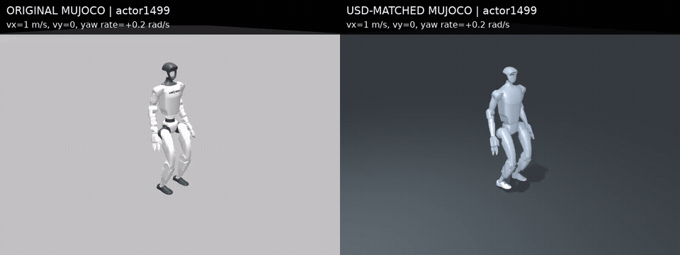

# USD 对齐模型：接触、执行器和首轮物理回放

**固定 1499 策略，USD 对齐的位置伺服模型六组均完成 30 秒，正转向不再转向负方向；仍有约 -0.1 rad/s 的零指令偏航，尚未通过行走/转向验收。**

本轮没有重新训练、修改默认入口或参考仓库，也没有 commit/push。原始模型和全部历史结果保留。

## 独立物理模型

从上一轮已核验的 44 身体、37 关节 MuJoCo 关节树出发：

- 导入实际 PhysX 质量、质心、惯量和 armature。
- 从原始 USD 提取两只脚和 torso 的三个凸包碰撞网格，保留各自在身体坐标中的原始顶点与三角面。
- 加入一个地面；机器人碰撞掩码 `(1,2)`，地面 `(2,1)`，允许地面接触、禁止机器人自碰撞。
- 采用实际 Isaac 配置的 Kp/Kd 和模拟力矩上限：踝 20 Nm，其余关节 300 Nm。这些是原训练仿真配置，不是验证过的硬件额定参数。
- 两个分支同为 1 ms 物理步长、`implicitfast`、100 次求解器迭代，分别使用外部每步 PD 力矩和 MuJoCo `position` 的 `kp/kv` 伺服。

MuJoCo `position/kv` 的隐式处理需要 `implicit` 或 `implicitfast`；外部显式算出的力矩不会自动把 PD 的速度反馈导数注册为执行器阻尼。这解释了本轮为何同时检查瞬时力矩和动态响应，参见 [官方执行器文档](https://mujoco.readthedocs.io/en/stable/XMLreference.html#actuator-position)、[官方积分器说明](https://mujoco.readthedocs.io/en/stable/computation/index.html#numerical-integration)。
MuJoCo 伺服仍不等同于 PhysX 的隐式 drive。单值摩擦 0.8 不等同于 Isaac 静摩擦 0.8/动摩擦 0.6；接触柔性和求解器也不同。

## 部件核验

冻结的关节坐标、身体质量、质心和惯量数组保持不变。两个执行器分支的模型数组只在 `actuator_gainprm`、`actuator_biasprm`、`actuator_biastype` 不同。
碰撞网格身体局部范围与 USD 顶点范围差最大约 3.2 nm。降低模型到地面后生成 8 个地面接触，全部是机器人—地面；未生成机器人—机器人接触。
在相同关节位置/速度/目标下，两种执行器均得到 `Kp*(target-q)-Kd*qvel`：最大力矩误差约 `7.55e-15 Nm`；大目标误差限幅核验误差 0。

悬空、无重力、0.01 rad 目标阶跃，分别测试髋、踝和手指，其余目标固定：

| 执行器分支 | 全关节峰值速度 | 结果 |
|---|---:|---|
| 外部显式 PD 力矩 | 约 270–271 rad/s | 手指目标末端误差约 -0.426 rad，出现高速振荡，不作为行走候选 |
| position 伺服 | 0.040–0.149 rad/s | 三组响应有限且平稳，允许进行本轮有限平地回放 |

不是所有“数值有限”的响应都可接受。显式分支只保留为诊断，没有继续运行行走策略。该执行器分支比较保持其余模型参数一致；原始模型与整个 USD 物理模型的比较则同时改变多项属性，不能归因于单一参数。
详情：[component_verification.json](component_verification.json)。

## 固定策略物理比较

同一 model_1499 NPZ actor，固定任务指令 `[vx,0,wz]`，前向速度 0.5/1.0 m/s，转向角速度 0/-0.2/+0.2 rad/s；平地、seed 42、初始高度 0.74 m、初始航向 0、策略周期 0.02 s、计划 30 s。
不使用航向反馈、监督器或切换。跌倒判据沿用骨盆高度 <0.35 m，并检查非有限值和 MuJoCo BADQPOS/BADQVEL/BADQACC 警告，无重置。

两组各六次，全部完成 30 s，没有上述终止/数值警告。指标排除前 2 s 启动阶段，均以相同公式计算。

| 前向指令 | 转向指令 | 原模型平均 world wz | 新模型平均 world wz | 原 / 新 world yaw RMSE |
|---:|---:|---:|---:|---:|
| 0.5 | 0 | -0.3651 | -0.0922 | 0.4129 / 0.1087 |
| 0.5 | -0.2 | -0.5705 | -0.3172 | 0.4546 / 0.1299 |
| 0.5 | +0.2 | -0.1321 | +0.1341 | 0.3800 / 0.0979 |
| 1.0 | 0 | -0.4580 | -0.1002 | 0.4887 / 0.1134 |
| 1.0 | -0.2 | -0.6962 | -0.3273 | 0.5421 / 0.1382 |
| 1.0 | +0.2 | -0.2456 | +0.1227 | 0.4731 / 0.1002 |

单位：速度 m/s，转向角速度与对应 RMSE rad/s。world wz 为根部世界角速度 z 分量，不是 Euler 航向变化率；另外保存 body angular z 指标。
六组等权平均：前向 RMSE `0.09115 → 0.03948 m/s`；world yaw RMSE `0.45858 → 0.11469 rad/s`。
正转向的方向修正，持续偏置仍存在；前向误差并非每组都改善，1 m/s、+0.2 条件从约 0.0640 增至 0.0718 m/s。

原模型对照本轮重新运行：每个策略边界先做 fresh `mj_forward`，让状态时间一致。这一点不同于旧参考代码的缓存字段采样，因此当前指标不得覆盖或直接视作以前记录的逐字复现。
新模型的几何、质量、接触、力矩上限、执行器和积分器等同时变化。这是整体对齐候选的表现，不能声称某一项独立导致全部改善。
仅单一 seed、两种速度、三个角速度、平地，没有可靠性/崎岖地形/扰动恢复验证；1999 尚未在新模型上重测。

[比较表](comparison.csv) · [全部结果](summary.csv) · [正转向同步 MP4](media/positive_turn_comparison.mp4)

视频展示真实物理回放的前 8 秒，左原始模型，右 USD 对齐模型；均用同一 1499 actor、`[1,0,+0.2]`。渲染读取保存状态，不再执行物理。

## 独立验证和保存

从每份保存的 qpos/qvel 重建全部状态信号：12×1501 个状态。另独立复算 384 个策略输入/动作，核验 warm-up、指标、时间轴、1500 动作/30000 物理步和实际力矩限幅。源文件哈希未变。常规 Python 和 `python -O` 验证通过。
证据：[replay_verification.json](replay_verification.json)。运行配置、原始逐组指标、源/模型/轨迹哈希在 `evidence/`，媒体文件附渲染说明与归档哈希。
本地原始目录：`checkpoints/flat_baseline/20261002/usd_contact_meshes/`、`usd_physical_models/`、`usd_physical_replays/`，均位于 `code/day9/g1_balance/` 下并被 Git 忽略。

新增脚本：`export_usd_contact_meshes.py`、`build_usd_physical_mujoco.py`、`verify_usd_physical_mujoco.py`、`evaluate_usd_physical_mujoco.py`、`analyze_usd_physical_replays.py`、`render_usd_physical_comparison.py`。

下一步测试原训练任务中的航向反馈：初始偏角纠正、目标 0/±90° 和稳定保持，并量化残余偏置。保持策略固定，不直接开启新 PPO、崎岖地形训练或 fallback 切换；也不凭本轮六次回放宣布默认基线通过验收。
