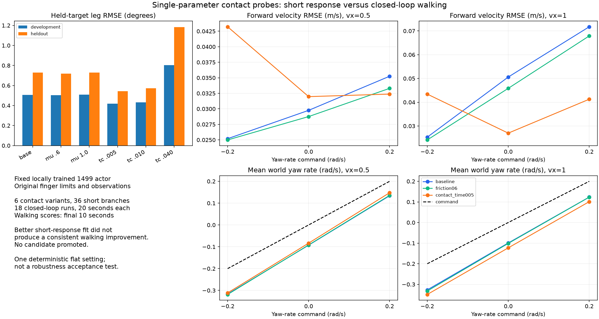

# 接触参数单项对照与行走复验（2026-10-03）

**结果：本轮没有找到可以替换 baseline 的接触参数候选。** 减小接触时间常数改善了相同初态下的短时腿部响应，但完整行走出现速度与转向的取舍；降低摩擦只产生小幅改变，持续负向偏转仍在。

## 固定条件与预先确定的选择规则

使用我们本地训练的 1499 actor，沿用 USD 对齐的 MuJoCo position 模型。保持 123D 观测、37D 动作、动作缩放、PD、原手指限位及手指输入不变；物理步长 1 ms、策略步长 20 ms。MJB、actor、metadata、辅助代码 SHA-256 见 `evidence/*/inputs.json`。未修改部署默认值，没有重新训练。

先复用上一轮 6 个实际 PhysX 支撑状态及其 200 ms 固定目标响应，不重新跑 Isaac。比较 6 个 MuJoCo 设置，每个设置 6 个分支，共 36 个新分支：

| 设置 | 唯一修改 |
|---|---|
| baseline | 无，摩擦 0.8、接触时间常数 0.02 s |
| friction06 | 可接触 geom 的滑动摩擦 0.8 → 0.6 |
| friction10 | 可接触 geom 的滑动摩擦 0.8 → 1.0 |
| contact_time005 | 可接触 geom 的 solref 时间常数 0.02 → 0.005 s |
| contact_time010 | 同一时间常数 → 0.01 s |
| contact_time040 | 同一时间常数 → 0.04 s |

接触时间常数修改不涉及关节限位的 jnt_solref。每次从原 MJB 重新加载，只修改上述一列，检查其余模型数组保持一致。

在跑分支前保存 `plan.json`：索引 0/2/4 为开发样本，1/3/5 为留出样本；每组各包含一个左支撑、右支撑、双支撑快照。分别在摩擦与接触时间常数两类中，以开发样本全部腿关节/时间点的 pooled RMSE 最低者进入完整行走，再报告留出成绩。**每类仅三份、同一行走来源的快照不是独立种子测试，也不是充分的泛化证据。**

冻结的代表为 `friction06` 与 `contact_time005`，见 `selection.json`。它们和 baseline 分别测试速度 0.5/1 m/s × yaw rate −0.2/0/+0.2 rad/s，共 18 次 20 秒行走。全程固定初态，原始未镜像 actor，未接入航向反馈；评分使用最后 10 秒。因此本轮是固定角速度指令测试，不是目标航向任务验收。

## 短时响应改善，没有自动转化为行走改善

| 设置 | 开发腿部 RMSE（rad） | 留出腿部 RMSE（rad） |
|---|---:|---:|
| baseline | 0.008855 | 0.012719 |
| friction06 | 0.008779（改善 0.87%） | 0.012555（改善 1.29%） |
| contact_time005 | 0.007306（改善 17.49%） | 0.009495（改善 25.35%） |

以上是角度对齐误差，不是行走任务误差；也不意味着所有关节或所有根部指标都改善。所有 6 个候选、逐状态结果见 `branch_metrics.csv`。

零转向指令下的完整行走：

| 速度 | 设置 | 平均世界角速度 z（rad/s，目标 0） | 前向速度 RMSE（m/s） |
|---|---|---:|---:|
| 0.5 | baseline | −0.09258 | 0.02976 |
| 0.5 | friction06 | −0.09173 | 0.02876 |
| 0.5 | contact_time005 | −0.08329 | 0.03197 |
| 1.0 | baseline | −0.09926 | 0.05060 |
| 1.0 | friction06 | −0.10134 | 0.04584 |
| 1.0 | contact_time005 | −0.12294 | 0.02699 |

接触时间常数候选在 0.5 m/s 时减小了零指令偏转，但前向速度误差增加；1 m/s 时前向速度误差减少，而偏转加重。

1 m/s 的两侧转向同样没有整体改善：

| yaw 指令（rad/s） | baseline 平均世界角速度 z | contact_time005 平均世界角速度 z |
|---:|---:|---:|
| −0.2 | −0.32697 | −0.34912 |
| 0 | −0.09926 | −0.12294 |
| +0.2 | +0.12352 | +0.10115 |

正指令仍然能产生正向转动，负指令产生负向转动；问题是跟踪存在负向偏差和左右幅度不对称，不能说“所有指令都只向右转”。本轮时间常数候选在 1 m/s 下三种指令的平均角速度跟踪误差都变差。

## 验证与结论边界

18 次行走均完成 20 秒：每次 1000 个动作、1001 个状态、20000 个物理步，未触发高度 <0.35 m 或数值失败条件。它们仅覆盖一个确定性平地初态，不构成鲁棒性验收。

独立验证器核对 19494 个采样状态及其信号、18000 个 actor 输出、模型数组隔离、初始关节状态、驱动力上限采样与记录峰值、时间/网格完整性、指标和输入哈希。新短时 baseline 的所有 NPZ 数组与上一轮完全相同；两档零 yaw 行走 baseline 的所有 NPZ 数组也与之前完全相同。正常模式与 `python -O` 的核验结果和 CSV 应按字节一致。这里不是监测开关无干扰测试，也不是逐物理步重放证明。

PhysX 与 MuJoCo 的材料模型、求解器及接触历史仍有差异。短时实验沿用上一轮重置分支，不能转移接触热启动状态。静摩擦/动摩擦的差异不能由一个 MuJoCo 摩擦系数完整复现。

本轮证明：**在已测试的单项参数范围内，改善短时腿部响应并不足以解决完整行走的偏转。** 没有排除接触动力学的贡献，也没有穷尽所有参数。没有依据把问题归结为某条腿较弱，或直接镜像复制网络权重。

下一步建议用有限的组合对照检查“已有手指限位对齐 × 接触响应调整”的交互，继续同时评分速度与左右转向；若组合仍无一致改善，再决定是否需要在已校准动力学条件下训练。不要扩大成无边界的参数搜索，不以更低的单项误差代替平地 baseline 验收。

## 归档

- 原始短时分支：`code/day9/g1_balance/checkpoints/flat_baseline/20261003/contact_parameter_branches/`。
- 原始行走：同目录 `contact_parameter_walking/`。
- 本报告包含预定计划、冻结选择、全部指标、核验证据、输入/运行版本、源文件快照、PNG/SVG、原始文件哈希与 SHA256SUMS。
- 六个新增脚本；原 actor、模型、旧报告和部署配置保持原样。没有 commit/push、supervisor 或 fallback 切换。
