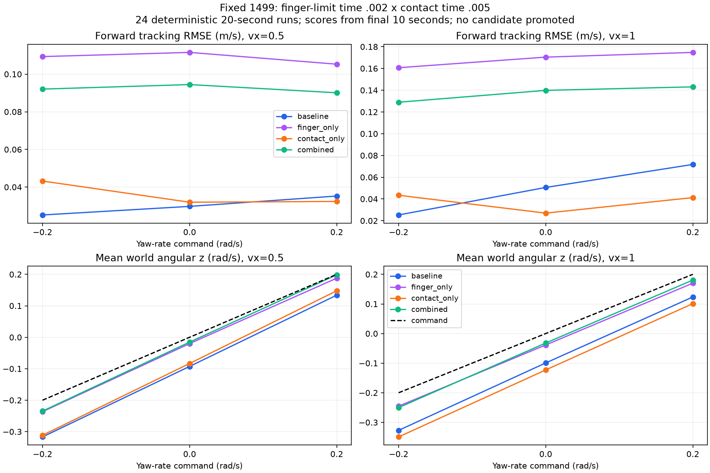

# 手指限位 × 接触响应：固定 1499 的组合对照（2026-10-03）

**组合减少了转向偏差，并缓解了“只改手指限位”带来的速度退化，但仍没有同时优于原 baseline。** 本轮保留组合为诊断候选，没有替换默认控制器。

## 预先固定的 2×2 实验

运行前保存 `plan.json`。使用我们本地训练的 1499 权重和既有 USD 对齐 MuJoCo MJB；物理步长 0.001 s、策略步长 0.02 s。四个条件：

| 条件 | 4 个活动手指 jnt_solref 时间常数 | 可接触 geom_solref 时间常数 |
|---|---:|---:|
| baseline | 原值 0.02 s | 原值 0.02 s |
| finger_only | 0.002 s | 原值 0.02 s |
| contact_only | 原值 0.02 s | 0.005 s |
| combined | 0.002 s | 0.005 s |

4 个手指为 left/right_four_joint 与 left/right_six_joint。其他模型数组、摩擦、关节范围、PD/armature/力上限、actor、123D 观测结构及动作缩放保持一致；不进行观测替换、镜像或删除维度。

每个条件测试速度 0.5/1 m/s、yaw rate −0.2/0/+0.2 rad/s，共 24 次 20 秒行走。初态固定于平地、高度 0.74 m、航向 0。最后 10 秒评分，分别记录 body 前向速度、世界/body angular z 和 Euler 航向变化。固定角速度指令，不接入目标航向反馈。

## 组合结果与取舍

零转向指令：

| 速度（m/s） | 条件 | 平均世界 angular z（rad/s，目标 0） | 前向速度 RMSE（m/s） |
|---:|---|---:|---:|
| 0.5 | baseline | −0.09258 | 0.02976 |
| 0.5 | finger_only | −0.02008 | 0.11154 |
| 0.5 | contact_only | −0.08329 | 0.03197 |
| 0.5 | combined | −0.01531 | 0.09446 |
| 1.0 | baseline | −0.09926 | 0.05060 |
| 1.0 | finger_only | −0.03859 | 0.17041 |
| 1.0 | contact_only | −0.12294 | 0.02699 |
| 1.0 | combined | −0.03198 | 0.13986 |

与 baseline 比，组合零指令的平均偏转绝对值降低约 83%/68%，但前向速度误差仍约为原来的 3.17/2.76 倍。与 finger_only 比，组合在这两组中同时改善偏转和速度；这不等于优于原 baseline。

完整三种转向指令下：组合的世界角速度 RMSE 在 6 组中全部低于 baseline，前向速度 RMSE 在 6 组中全部高于 baseline。1 m/s 时，组合实际平均角速度分别为 −0.25014/−0.03198/+0.18066 rad/s（指令 −0.2/0/+0.2），两侧仍有跟踪误差。

## 两因素的交互

两项改动的效果不是简单相加。在 1 m/s、零指令时，contact_only 使平均世界 angular z 从 −0.09926 变成 −0.12294；已有手指限位修改时，同一接触修改却使它从 −0.03859 变成 −0.03198。其效果依赖另一项设置。

`interactions.csv` 对每个指令报告 `combined − finger_only − contact_only + baseline`。这是确定性实验中的数值交互描述，不是带重复样本的显著性检验，也不是两条因果路径的贡献百分比。RMSE 本身包含非线性，不能把该差值解释成独立物理力的叠加。

## 验证、结论和下一步

24 次均完成 20 秒：各有 1000 动作、1001 状态、20000 物理步，未触发高度 <0.35 m 或数值失败条件。只覆盖单个确定性平地初态，不是种子/扰动/地形鲁棒性验收。

独立核验 24024 个状态与信号、24000 个 actor 输出、24 格完整性、时间/指标、模型数组隔离、输入哈希及驱动力采样/峰值上限。14 份旧对照的所有 NPZ 数组完全一致：6 份 baseline、6 份 contact_only、两档零指令 finger_only。正常模式和 python -O 的证明、指标 CSV、交互 CSV 与原始哈希清单按字节一致。

本轮排查已确认存在速度/方向取舍和两项参数交互，不能仅凭偏转变小推广组合，更不能断言必须重新训练。下一步应在相同指令和计时协议下，把原 baseline 与组合候选同原生 Isaac 行走对照，区分“更接近训练环境”与“在 MuJoCo 上任务分数更高”；随后决定还有哪些动力学项需校准，或是否需要策略训练。避免继续无边界扩大参数网格。

原始结果：`code/day9/g1_balance/checkpoints/flat_baseline/20261003/finger_contact_factorial/`，包含完整轨迹；此目录被 Git 忽略。本报告保存计划、指标、交互、核验证据、运行/输入清单、源快照、原始文件哈希及 PNG/SVG。四个新脚本已编译检查。没有修改参考仓库、原 actor/MJB、默认部署、supervisor/fallback；没有训练、commit 或 push。
