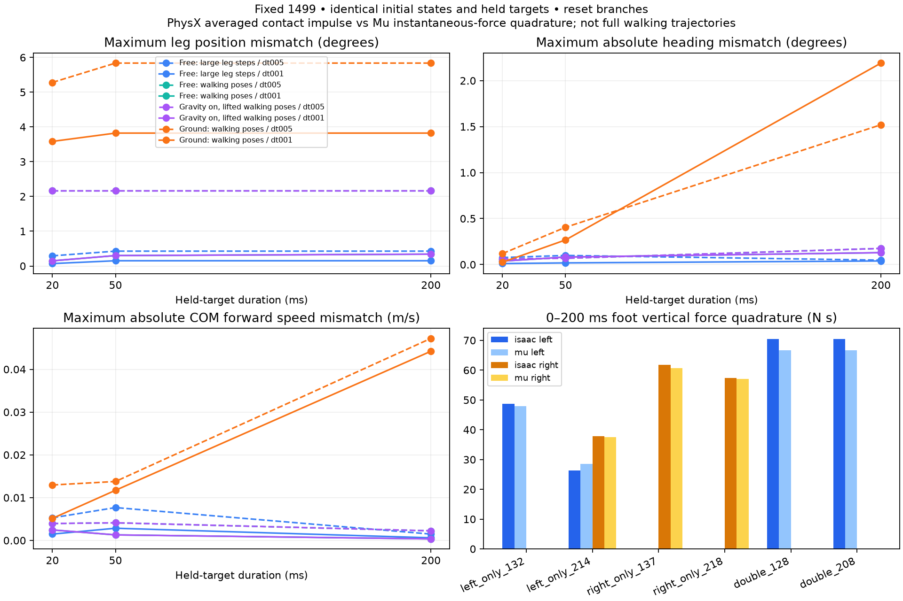

# 固定 1499：腿部驱动与落地接触的跨引擎对照（2026-10-03）

本轮结果把下一步排查重点收敛到**落地接触后的踝关节响应**。在这批初态和固定目标下，Isaac/PhysX 与 MuJoCo 的无接触腿部响应较接近；落地后误差显著增加。不能据此认定接触是全部持续右偏的唯一原因，也没有证明某条腿或某个关节存在固定“弱侧”。

## 实验与输入

固定我们本地按参考配置训练的 1499 actor，未使用参考作者权重或 1999。actor SHA-256：`ae0ca6b9677a19ffbc09325733ce3673d6ef7732547d96662a85016d84de31f0`。既有 USD 对齐 MuJoCo MJB SHA-256：`cbb38fab0d81b127175195106bdd1254f22ee0f105b04655db29075c2955e3fd`。本轮未改变这两份文件，也未改变部署默认配置。

- 实际 Isaac 16 环境、seed 42、平地，指令 `(vx, vy, wz)=(1,0,0)`，关闭观测噪声。记录环境 0 的 300 个策略时刻（0–5.98 秒），策略步长 0.02 秒，物理步长 0.005 秒。逐条独立重算 actor 和 `defaults + 0.5 * action` 的目标。
- 取启动后左脚单支撑、右脚单支撑、双脚支撑各两个状态，共 6 个。分类依据源行走记录足部竖直力 >20 N，仅为本次取样条件，不是安全阈值。源状态索引、时间和脚力见 `evidence/leg_contact_isaac/cases.json`。分类描述取样时刻，重置分支后支撑状态可能改变。
- 实际 PhysX 的 6 个落地分支，重新写入根部和 37 关节状态，固定该状态对应的 37D 目标 200 毫秒，策略不再反馈。
- 相同 6 个状态再做“抬高到 2 米、关闭重力”和“抬高到 2 米、保留重力”的对照。后者避免把重力变化误判为接触差异。两类抬高分支的 t>0 接触力均为零。
- 另做 24 个无重力、无接触的大幅腿部目标测试：12 个髋/膝/踝关节分别从默认姿态给 ±0.2 rad 目标阶跃。不是重新训练，也不是行走时人工干预某条腿。
- 总计 42 个 PhysX 短时分支。MuJoCo 对每个分支各做 5 毫秒和 1 毫秒物理步长回放，合计 84 个，全部采样到同一组 41 个时间点。坐标转换按 root link 位姿/线速度、世界角速度与 COM 世界速度分别核验；自由关节角速度转回局部坐标。

版本：IsaacSim 5.1.0.0、当地 IsaacLab 2.3.2、Python 3.11.16、NumPy 1.26.0、Torch 2.7.0+cu128；MuJoCo 3.14.0、NumPy 2.5.3。实际配置、增益、阻尼、armature、力上限及输入哈希均归档。

## 结果

下表采用 MuJoCo **1 毫秒**回放。关节误差为各组 0–200 毫秒内、12 个腿关节的最大值；航向/速度误差为 200 毫秒时各组的最大绝对差。速度是根部 COM 的世界 x 分量，不是此前闭环行走评估的 body 前向速度 RMSE。

| 对照 | 分支数 | 最大腿部角度误差 | 最大航向误差 | 最大 COM 世界 x 速度误差 |
|---|---:|---:|---:|---:|
| 无重力、无接触：±0.2 rad 大目标 | 24 | 0.002633 rad / 0.151° | 0.039° | 0.000612 m/s |
| 无重力、无接触：实际行走姿态 | 6 | 0.005942 rad / 0.340° | 0.129° | 0.000357 m/s |
| 保留重力、无接触：同一行走姿态 | 6 | 0.005942 rad / 0.340° | 0.129° | 0.000359 m/s |
| 保留重力、落地：同一行走姿态 | 6 | 0.066727 rad / 3.823° | 2.191° | 0.044215 m/s |

保留/关闭重力的抬高对照，腿部位置误差接近到数值精度，因此本组“落地与抬高”的差异不是只由重力开关解释。落地组 6 个状态中，4 个最大误差落在踝 pitch；另外两个在右膝。不同状态的航向差可正可负，不能把本轮短时航向差称为统一右偏来源。

时间步长仍然重要：5 毫秒回放中，实际姿态无接触最大腿部误差 0.037939 rad，落地 0.101875 rad。1 毫秒显著改善关节对照，但没有让所有指标同时改善：落地航向的最大差从约 1.520° 增至 2.191°。不能以关节角度改善直接宣称行走或转向已修好。

完整逐状态、逐步长、20/50/200 毫秒结果见 `summary.csv`。

## 结论的边界

- 分支写入相同可记录状态，但没有转移求解器历史、接触缓存/热启动。这些是**重置后的固定目标响应**，不是完整闭环行走轨迹，也不是对历史轨迹严格复现。
- MuJoCo 单滑动摩擦系数 0.8，与 PhysX 静摩擦 0.8/动摩擦 0.6 并不完全相同；接触柔度、求解器、碰撞实现也仍有差异。本轮尚未定位其中哪项配置最关键。
- PhysX 接触传感器是物理步冲量除以 dt；MuJoCo 本轮保存重算状态时的瞬时接触力。图中脚力积分使用 5 毫秒端点矩形求积，不能当成两引擎完全一致定义的逐步冲量。t=0 的 PhysX 接触读数不用于积分或无接触判断。
- MuJoCo 力从接触坐标变换到世界坐标并对足部累加，方向按 geom1→geom2。[MuJoCo 力接口](https://mujoco.readthedocs.io/en/stable/APIreference/APIfunctions.html#mj-contactforce)、[接触力方向约定](https://mujoco.readthedocs.io/en/stable/computation/index.html#contact)。PhysX 隐式驱动的 computed/applied torque 不被称为测得的真实驱动力矩。
- 这是一个固定速度、固定 seed 的小样本诊断，不能证明鲁棒性或完成平地/转向验收。手指观测影响腿部输出的上一轮证据依然保留；本轮固定目标分支消除了新的策略反馈，不会撤销上一轮结论。

## 核验与归档

独立脚本检查 300 条源 actor 输出与目标、6 个支撑分类、全部输入文件哈希、初始关节/根部 COM 坐标、Kp/Kd/armature/力上限、3444 个 MuJoCo 采样状态及身体/COM/驱动力/足部接触力重构、84 个分支的目标与时间点。接触力重构允许 0.001 N 的求解器数值差，实际最大差记在 verification.json。正常模式与 `python -O` 均须退出成功并生成同样的核验证据。

原始结果：`code/day9/g1_balance/checkpoints/flat_baseline/20261003/leg_{contact,free,lifted}_{isaac,mujoco}/`（Git 忽略）。公开报告保存运行配置、输入清单、源脚本、原始文件哈希和 PNG/SVG。

最初 contact/free 两次捕获发生在添加 lifted 选项之前，其脚本按字节保留为 `leg_contact_isaac/source.py`；原输入清单仍指向当时的 canonical 脚本路径。验证器发现 canonical 版本改变时，核对该冻结源文件的原哈希，不跳过源代码证据。

下一步优先对落地条件做单参数摩擦/接触柔度校准，再用原 actor 检查前向速度、航向及左右转向。保持已有 baseline、手指输入和权重不变；只有同时改善行走与转向的候选才进入后续验收。没有 commit/push、训练、supervisor 或 fallback 切换。

源归档过程中曾调整旧捕获脚本的记录路径；lifted 捕获读到过渡版 source manifest。该清单的原字节已按捕获记录的 SHA-256 重建并保留为 `leg_lifted_isaac/source_manifest_at_capture.json`，验证器核对这份快照。变动涉及源文件路径与清单哈希，不涉及物理结果或模型/目标；不以直接替换期望哈希来绕过验证。
