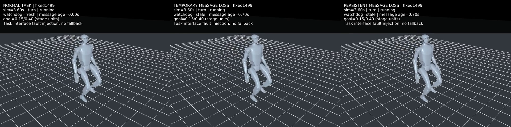
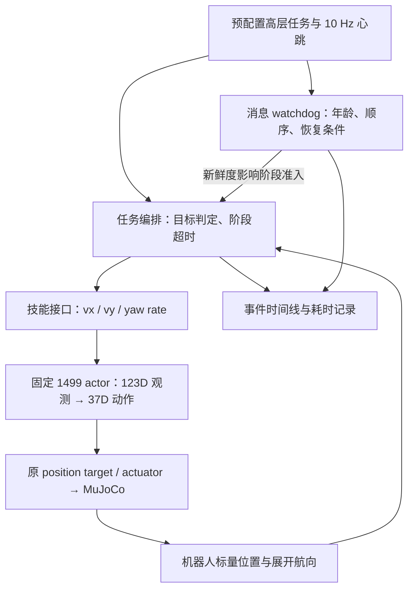
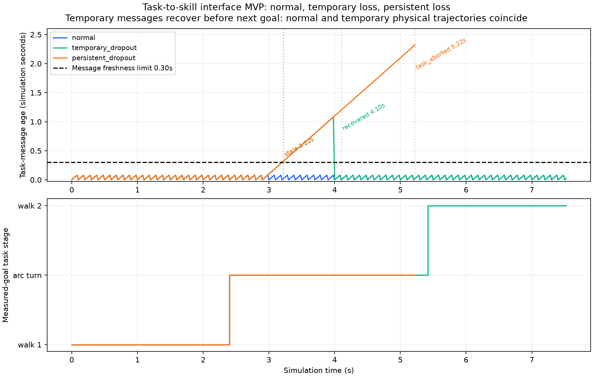

# G1 分层接口演示 MVP（2026-10-03）

第一版已实现任务编排、技能命令接口、消息新鲜度 watchdog、可解释事件时间线和墙钟耗时评估。使用已有本地 1499 actor 与冻结的 USD 对齐 MuJoCo 模型，完成三个仿真场景。**这是任务—技能—诊断监督的软件原型；没有验证安全停车、fallback 或真实感知故障后的恢复。**

[观看 8 秒三场景对照视频](media/hierarchical_demo.mp4)。左：正常任务；中：3–4 秒丢弃任务消息；右：3 秒后持续丢弃。字幕显示任务阶段、目标进度、消息年龄及 watchdog 状态。实验结束后显示最后一个记录状态，并标注 SIMULATION ENDED，不能把冻结画面解释为机器人安全停止。视频仅重绘保存状态，没有推进物理；地面网格是渲染场景中的视觉线条。



## 已打通的层次



高层任务固定为：前进 1 m → 相对航向增加 0.4 rad → 再前进 1 m。两种参数化技能共用同一个 actor：前进命令 `(0.5,0,0)`，弧线转向命令 `(0.5,0,0.2)`；没有独立训练的多技能网络或 VLA 任务理解。

前进完成条件是相对阶段起点、沿起点航向的投影位移达到 1 m，不是沿路径行进距离，也不证明严格直线。转向完成条件是展开 Euler 航向相对阶段起点增加 0.4 rad。每阶段 8 s 超时，总实验最多 20 s。任务切换由观测目标完成触发，不是预先安排的固定时刻。

物理步长 1 ms、策略与任务监督周期 20 ms，心跳周期 100 ms。消息年龄 >0.30 s 判为 stale；恢复需两条新鲜且有效的新消息；stale 持续 2 s 后中止任务。参数是本原型的接口实验配置，不是机器人安全阈值。

## 三种实际结果

| 场景 | watchdog 事件（仿真时间） | 任务结果 |
|---|---|---|
| 正常 | 全程 fresh | 2.40 s 完成第一段；5.42 s 完成转向；7.52 s 完成第二段 |
| 3–4 s 消息丢失 | 3.22 s stale；4.00 s 首条恢复消息；4.10 s fresh | 7.52 s 完成任务 |
| 3 s 起持续丢失 | 3.22 s stale；5.22 s communication_timeout | 中止仿真实验，停留在转向任务阶段 |

消息失效后保留上一条技能命令，仅阻止下一任务阶段。机器人仍会运动。短暂中断在下一个目标到达前恢复，所以本场景的任务切换时刻与正常场景一致，物理轨迹也相同；**不能据此宣称 watchdog 提升了控制性能或完成了故障恢复**。消息失效时目标已达到也不准入下一阶段的逻辑，另有接口测试覆盖；下一轮可以专门在阶段交接点注入中断。

当前故障源只丢弃高层任务心跳，机器人状态仍由仿真直接提供。它验证消息接口中断，不能冒充相机、ROS 网络或 VLA 感知失效。

## 时间预算与证据

正常场景记录事件时，任务逻辑 P99 为 **0.0329 ms**，观测构建与 actor P99 为 **0.1195 ms**，包含物理与逐步哈希记录的总 policy frame P99 为 **2.5132 ms**。六次回放记录中，超过 20 ms 的 frame 数均为 0。所有数字来自墙钟 `perf_counter_ns`；watchdog 的 3.22 s 等时间来自仿真时钟，两者不混用。离线无图形计算、单线程 NumPy、本机小样本成绩不等于硬实时保证；视频渲染、网络、感知与硬件未计入。

三个场景各做事件日志开启/关闭对照，共六次回放。所有 trace NPZ 数组（状态、观测、动作、目标、峰值力）与决策完全一致；每物理步 qpos/qvel/ctrl 的 SHA-256 摘要也一致。watchdog 在两侧均启用，**这是事件日志无干扰证明，不是 watchdog 开/关效果对照**。

独立核验通过：2032 个采样状态、2026 个 actor 输出、任务/watchdog 决策和事件重放、消息故障日程、动作缩放、驱动力上限采样/峰值、时间计数与耗时分位数。16 项接口测试覆盖目标判定、消息异常、恢复、超时、时间倒退、终态重用与命令契约。正常模式与 python -O 均通过；两种模式生成的证明、结果 CSV 与原始哈希清单按字节一致。六次均未触发本演示高度 <0.35 m 检查或数值失败，仍非多种子/扰动鲁棒性验收。



## 运行和项目对应关系

需要已有本地固定1499 NPZ、metadata 和 USD 对齐 MJB；它们不是全新 clone 自动附带的资源，输入哈希见 evidence/inputs.json。使用一个尚不存在的输出目录：

```bash
OPENBLAS_NUM_THREADS=1 .venv/bin/python scripts/run_hierarchical_demo.py \
 --reference-root /home/omai/robotics/reference_projects/g1_walk_isaaclab_mujoco \
 --model code/day9/g1_balance/checkpoints/flat_baseline/20261002/usd_physical_models/g1_usd_physical_position.mjb \
 --output /tmp/g1-hierarchy-NEW
.venv/bin/python -m unittest discover -s tests -p test_task_sequence.py -v
```

本轮研究层间接口、任务分解／技能编排、时序预算、watchdog 和定量评估。剩余工作是阶段交接点故障、真实感知接口契约、兼容当前行走接口的独立 fallback 及其恢复/切换对照，而不是把当前消息恢复称为身体恢复。

原始回放：`code/day9/g1_balance/checkpoints/hierarchical_demo/20261003/`（Git 忽略）。本报告归档计划、版本与输入清单、指标/验证、逐场景事件/决策/耗时、代码快照、原始哈希、视频与图表。没有改变 actor、MJB、参考仓库、原被动监测或旧 64D 站立控制器；没有训练、commit 或 push。
