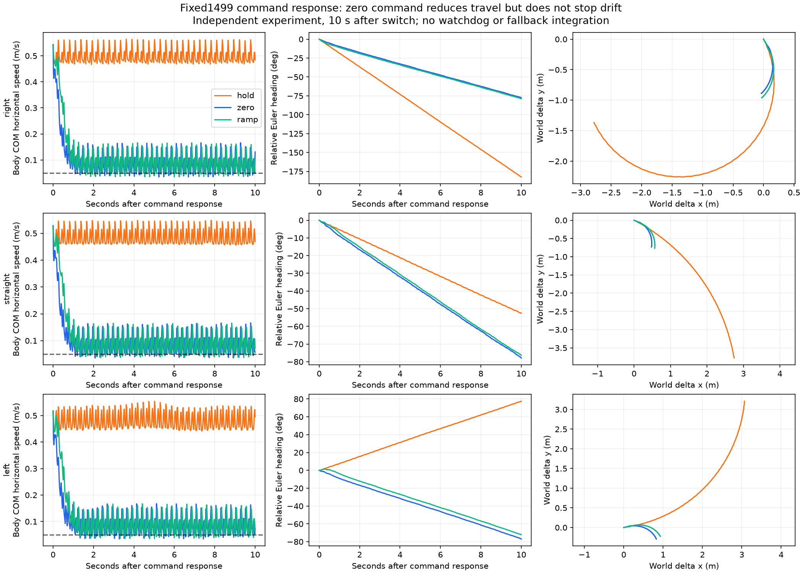

# 独立减速／零速命令响应（2026-10-03）

**固定1499能响应归零指令减慢移动，但在当前MuJoCo配置里没有停稳。** 九组都完成10 s观察，没有高度失败或数值终止；立即归零和0.5 s归零最终仍持续漂移，所以本轮不将其接入watchdog作为停车或fallback。

[观看左转过程的三响应视频](media/command_response.mp4)：左保留原命令，中立即归零，右0.5 s线性归零。视频16 s，命令改变在5.22 s；命令值与实际速度分开显示，delta yaw以5.22 s状态为参考。视频只展示左转起始状态，以下指标覆盖全部九组。

## 预先固定的协议

使用同一个本地从零训练1499 NPZ、123D观测/37D动作接口、原metadata与USD对齐MJB，原动作缩放/default姿态/力限位。没有镜像、手指限位或接触参数改动，没有训练。没有修改任务编排或watchdog默认响应；本轮运行器没有连接watchdog。

三种前序：0–2.40 s先 `(vx=.5,vy=0,yaw=0)`，2.40–5.22 s分别直行/yaw=-.2/yaw=+.2；5.22 s分别保留命令、三个命令量立即变0、用0.50 s线性变0。到15.22 s结束，共9组、每组761次actor调用/762采样状态/15220物理步。每组从相同初态运行，改变命令时不重置机器人、策略上一动作或观测状态。物理1 ms，策略20 ms；没有随机扰动或多种子实验。

计划在运行前写入plan.json并哈希。对每个方向，改变命令前的3组完整状态、观测、动作、目标完全一致，逐物理步前缀摘要也一致；固定左转保留命令的前7.22 s与上一轮持续消息中断所有状态和动作完全一致，之后继续观察，不因原任务中止而提前结束。

## 十秒响应结果

航向正为左转、负为右转，使用根四元数计算的展开Euler航向，**不是body angular z**。路径是根xy每20 ms采样的折线路径长度；速度是pelvis质心速度变换到body坐标后的水平分量范数，两者不是同一个测量点。最后2 s报告RMS，不是平均带符号速度。

| 前序与响应 | 改命令后路径 m | 航向变化 ° | 最后2 s水平速度RMS m/s | 最后2 s Euler航向率RMS rad/s | 探索性停稳判据 |
|---|---:|---:|---:|---:|---|
| right_hold | 4.937 | -182.4 | 0.500 | 0.322 | 未满足 |
| right_zero | 1.057 | -77.4 | 0.096 | 0.149 | 未满足 |
| right_ramp | 1.131 | -78.9 | 0.095 | 0.152 | 未满足 |
| straight_hold | 4.850 | -52.5 | 0.487 | 0.107 | 未满足 |
| straight_zero | 1.049 | -77.9 | 0.096 | 0.151 | 未满足 |
| straight_ramp | 1.127 | -76.3 | 0.097 | 0.149 | 未满足 |
| left_hold | 4.809 | +77.4 | 0.482 | 0.150 | 未满足 |
| left_zero | 1.047 | -76.9 | 0.095 | 0.152 | 未满足 |
| left_ramp | 1.119 | -72.1 | 0.095 | 0.152 | 未满足 |

归零两种方案路径1.047–1.131 m，最后2 s水平速度RMS约0.095–0.097 m/s、Euler航向率RMS约0.149–0.152 rad/s。三种前序归零后均向右漂移，约72–79°/10 s；这说明当前零指令响应有持续偏差，不足以独立定位是权重、模型还是接触的原因。

对最接近原演示的左转前序：改命令后前2 s，保留命令走0.960 m、航向+15.54°；立即归零走0.302 m、航向-16.70°；0.5 s归零走0.379 m、航向-11.98°。两种归零均减少移动量，但缓归零并没有同时减少所有指标；没有单凭路径长度推广某个方案。

全九组最大绝对roll/pitch分别约9.15°/3.98°、最低pelvis高度约0.641 m。它们仅说明本配置本次没有触发高度失败，不证明稳定站立、安全停车或扰动鲁棒性。



## 停稳判据和核验

探索性判据预先固定：完整尾随0.5 s窗口内，水平速度均值≤0.05 m/s且Euler航向率RMS≤0.05 rad/s，连续保持1 s。分别记录满足区间起点、足够持续时间后确认的时刻、确认后的首次逃逸；不足一个完整窗口不能提前判稳。所有九组均没有确认停稳。该判据只服务软件实验，不是安全边界。

5项分析测试（ramp边界/两通道、完整窗口+持续时间、转向不能误判停车、短暂慢速不能判稳、确认后重新漂移）在正常/python -O均通过。四个脚本和测试编译通过。

独立重建6858个采样状态、重新计算6849个actor输出；核验初态、九组日程、完整观测/动作/目标、信号坐标、力上限采样/峰值、结束条件及指标。6个同方向响应前缀配对状态/动作和逐物理步摘要一致。正常/python -O验证和原始哈希清单按字节一致。逐物理步摘要仅用于前缀一致性；没有完整重新积分来验证原始每一步动力学。

视频重新渲染保存状态，物理步数为0，地面网格仅属于渲染场景。实验结束后保留末帧并标注SIMULATION ENDED，不代表机器人停下。

## 复现和下一步

本地模型和权重需要已有资源，不随clone自动提供。运行版本/输入哈希在evidence内；原始九份trace在Git忽略的 `code/day9/g1_balance/checkpoints/hierarchical_demo/20261003/command_response/`。

```bash
OPENBLAS_NUM_THREADS=1 .venv/bin/python scripts/evaluate_command_stop.py \
 --reference-root /home/omai/robotics/reference_projects/g1_walk_isaaclab_mujoco \
 --model code/day9/g1_balance/checkpoints/flat_baseline/20261002/usd_physical_models/g1_usd_physical_position.mjb \
 --output /tmp/g1-command-response-NEW
OPENBLAS_NUM_THREADS=1 .venv/bin/python scripts/verify_command_stop.py \
 --run /tmp/g1-command-response-NEW \
 --reference-root /home/omai/robotics/reference_projects/g1_walk_isaaclab_mujoco \
 --model code/day9/g1_balance/checkpoints/flat_baseline/20261002/usd_physical_models/g1_usd_physical_position.mjb \
 --output /tmp/g1-command-response-proof
```

当前可交付内容增加了“通信准入有效，但零命令不能保证停车”的量化证据。截止日前优先整理分层架构、任务/watchdog演示、时序预算和失效限制。若继续控制实验，应单独校准兼容123D/37D的低速保持/恢复技能，并验证交接，不能把旧64D站立控制器或本次零速命令直接当fallback。没有commit/push。
