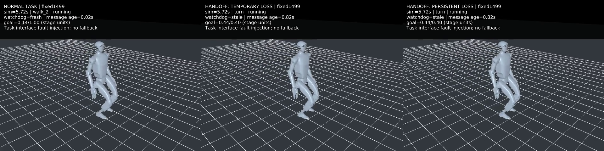
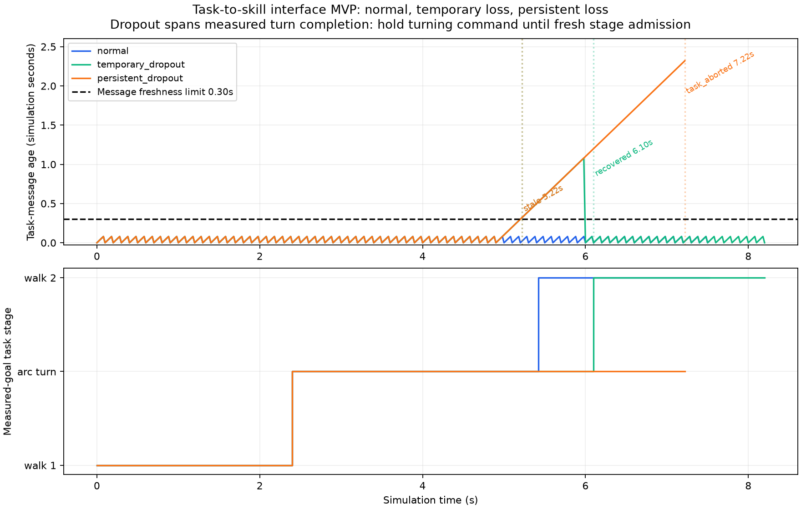

# 阶段交接点的消息中断对照（2026-10-03）

在第一版接口演示基础上，只将故障日程改为覆盖转向完成时刻。固定本地从零训练的1499 actor、123D/37D接口和USD对齐MuJoCo模型；未改权重、模型接触参数或任务监督逻辑。高层任务仍为前进1 m → 相对航向增加0.4 rad的弧线转向 → 前进1 m。

[观看9秒三场景视频](media/hierarchical_demo.mp4)。左：正常消息；中：5–6 s暂停任务心跳；右：5 s起持续暂停。5.7 s附近，左侧已经进入walk_2，中/右侧目标已经达到却仍保持turn。



## 冻结的实验协议

新增 `--suite handoff`，保留默认 `initial`。三个场景分别正常、[5,6) s丢消息、[5,∞) s丢消息；每场景事件日志开启/关闭，共六次实际回放。故障日程在运行前写入plan.json并哈希。物理1 ms、策略/监督20 ms、心跳100 ms；消息年龄超过0.30 s变stale；恢复需两条新鲜有效消息；stale持续2 s中止仿真实验。每阶段8 s超时。机器人状态始终可读；故障只发生在任务心跳链路，没有相机或实际网络故障。

前进目标按阶段起点航向投影位移判断，转向按展开Euler航向相对阶段起点判断。不是严格直线或原地转向验收。

## 结果

| 场景 | 目标到达与准入 | 结果 |
|---|---|---|
| 正常 | 5.42 s达到转向目标并进入walk_2 | 7.52 s完成任务 |
| 短暂消息中断 | 5.22 s stale；5.42 s达到目标但被阻止进入walk_2；6.00 s首条恢复消息仍recovering；6.10 s第二条消息确认fresh并准入 | 8.20 s完成任务 |
| 持续消息中断 | 5.22 s stale；5.42 s达到目标后继续禁止新阶段 | 7.22 s communication_timeout，中止仿真实验 |

短暂中断延迟交接0.68 s，共34个目标已达到却未准入的采样点。持续中断有90个运行中目标已达到但未准入的采样点，直到中止都没有进入walk_2。

**阶段准入门控有效，但保留上一条转向命令有可测量的代价。** 短暂中断恢复交接时转角为0.494303 rad，超过0.4 rad目标0.094303 rad（约5.40°）。这是交接时的总超出量，包含正常离散采样/策略响应；不是全部归因于watchdog的严格因果分解。机器人失联时继续前进转弯，没有安全停车或身体恢复，任务终止仅结束仿真。

直到5.42 s交接采样点，正常/两种故障场景状态完全一致，该点之前动作完全一致；从该点起正常改为前进命令，故障场景保留转向命令，actor动作实际开始不同。任务状态恢复不等于身体状态恢复。

## 核验与时间预算

17项接口测试正常/python -O均通过，包括新增转向交接延迟测试：目标到达后保持转向，第一条恢复消息不能准入，第二条才建立新的前进阶段起点。

独立重建2300个采样状态、重新计算2294个actor输出，核验消息日程、任务/watchdog决策、事件、目标缩放、力上限及时间指标。额外直接检查“目标已到达而仍被阻止”“第二条恢复消息才准入”“持续丢消息未准入”。正常/python -O四份证明和指标文件按字节一致。三个日志开启/关闭配对所有NPZ数组、决策和逐物理步状态/控制摘要完全一致，证明日志无干扰；不是watchdog开关对照。本轮正常场景所有NPZ数组也与前一轮正常场景完全一致。

本轮正常/日志开启任务逻辑P99为0.024073 ms，actor P99为0.113585 ms，完整headless控制帧P99为2.755338 ms。六次均无记录帧超过20 ms、无高度低于0.35 m或数值终止；仅为本机短时单配置结果，未验收鲁棒性或硬实时。



视频仅渲染保存状态，没有物理步进。额外地面网格只属于渲染场景。实验结束后保留末帧并标注SIMULATION ENDED；冻结画面不是机器人停止。ffprobe核验1920×480、25 fps、225帧、9 s，预览已检查。

## 复现

需要已存在的本地模型/NPZ/metadata；版本和完整输入哈希见evidence/complete.json和evidence/inputs.json。输出路径必须尚不存在：

```bash
OPENBLAS_NUM_THREADS=1 .venv/bin/python scripts/run_hierarchical_demo.py \
 --suite handoff \
 --reference-root /home/omai/robotics/reference_projects/g1_walk_isaaclab_mujoco \
 --model code/day9/g1_balance/checkpoints/flat_baseline/20261002/usd_physical_models/g1_usd_physical_position.mjb \
 --output /tmp/g1-handoff-NEW
OPENBLAS_NUM_THREADS=1 .venv/bin/python scripts/verify_hierarchical_demo.py \
 --run /tmp/g1-handoff-NEW \
 --reference-root /home/omai/robotics/reference_projects/g1_walk_isaaclab_mujoco \
 --model code/day9/g1_balance/checkpoints/flat_baseline/20261002/usd_physical_models/g1_usd_physical_position.mjb \
 --output /tmp/g1-handoff-proof
```

原始六份trace在被Git忽略的 `code/day9/g1_balance/checkpoints/hierarchical_demo/20261003/handoff/`，哈希清单见raw_hashes.json；归档包括源码快照、事件/决策/消息/耗时证据、验证和媒体。

下一步优先独立验证消息失效后的减速/零速命令响应，测量额外位移、航向、身体稳定性；零速命令不自动等于稳定站立或安全停车。通过后再考虑接入监督响应与明确恢复条件。在截止日前保留当前演示作为诚实可复现的层间接口成果，没有重新训练、默认部署更改、commit或push。
