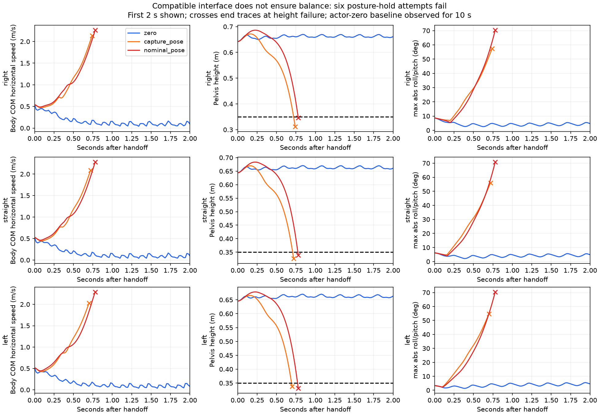

# 当前接口的静态姿态保持尝试：六组失败（2026-10-03）

**两种123D/37D兼容的静态姿态保持方案都失败了，不能作为fallback。** 九组实际回放包含三种方向×零命令actor/捕获当前姿态/默认姿态保持。六个姿态保持分支在切换后0.70–0.78 s触发高度失败；零命令actor则完成10 s观察但仍漂移。软件接口与数据核验通过，不代表控制性能通过。

[观看7秒左转前序的三方案对照](media/posture_hold.mp4)：左继续actor并给零命令，中保持切换时姿态，右保持默认姿态。5.22 s交接；中/右倾倒后结束仿真实验，字幕明确HEIGHT FAILURE，最后一个采样画面被冻结，不是物理停车。视频只展示左转前序和最初约1.8 s交接过程；完整九组结果在下面。

## 为什么选这一步

从原1499训练保存的params/env.yaml核对：`rel_standing_envs=0.02`、`heading_command=true`、vx范围[0,1]，vy[-.5,.5]、yaw[-1,1]。因此配置包含站立命令采样，不能说模型没见过零速；2%是配置比例，不是重新统计出的实际训练样本比例，也不能保证MuJoCo停车。证据快照/哈希见evidence/training_interface_audit.json和training_env.yaml。

旧`PDStandController`依赖旧balance配置OBS_DIM=64/ACTION_DIM=6，产生6D残差，不能直接替代当前123D/37D行走接口。本轮没有导入或复用旧控制器。

新增ExperimentalPostureHold独立试验类，没有注册到watchdog/supervisor，也没有修改原默认响应。它接收123D观测与前一37D动作，在原37关节映射和 `target=default+scale*action` 的位置执行路径中输出37D动作。capture_pose读取观测12:49关节相对位置并冻结；nominal_pose取默认位置。目标按当前模型的关节范围裁剪，不改模型限位。执行器仍提供原局部关节位置反馈；**候选没有身体速度、重心、姿态或接触状态的平衡反馈**。

## 冻结的比较协议

固定本地1499、原metadata/USD物理MJB、原位置执行器增益/力上限、物理1 ms/策略20 ms。前2.40 s直行vx=.5，然后分别yaw=-.2/0/+.2。5.22 s给零命令，分别继续1499，或者从上一已执行37D动作向姿态保持目标做0.50 s smoothstep过渡。

过渡权重w=3u²−2u³，u=clip((t−5.22)/.50,0,1)。交接首帧动作与前帧完全相同，没有动作阶跃；不重置位置、速度、上一动作或物理状态。最终姿态目标按model.jnt_range限制，过渡初始目标继承原actor输出，未额外裁剪原actor。

在运行前保存plan并哈希。最长继续观察10 s；每个20 ms采样点pelvis高度<0.35 m就结束该仿真实验。失败时刻是采样检测时刻，不是第一次物理接触或任何安全判据。没有扰动、多种子、站立初态、不同步态相位或主动恢复实验。

## 结果

| 前序/方案 | 实际交接后观察 s | 结果 | 最大绝对roll / pitch ° |
|---|---:|---|---:|
| right_zero | 10.00 | 完整观察，仍漂移 | 8.7 / 4.0 |
| right_capture_pose | 0.74 | 高度失败 | 48.9 / 57.3 |
| right_nominal_pose | 0.78 | 高度失败 | 15.6 / 70.3 |
| straight_zero | 10.00 | 完整观察，仍漂移 | 6.2 / 3.9 |
| straight_capture_pose | 0.72 | 高度失败 | 50.1 / 56.1 |
| straight_nominal_pose | 0.78 | 高度失败 | 18.2 / 70.8 |
| left_zero | 10.00 | 完整观察，仍漂移 | 5.8 / 3.9 |
| left_capture_pose | 0.70 | 高度失败 | 52.4 / 54.7 |
| left_nominal_pose | 0.78 | 高度失败 | 26.4 / 70.4 |

所有姿态保持候选均未满足预先延用的停稳判据（完整尾随0.5 s速度/航向率窗口、连续1 s）。它们在足够判稳前就倾倒。各候选的“最后2 s”指标实际上只覆盖0.70–0.78 s失败前全部片段，不可与零命令actor完整10 s末尾直接横向比较。更短路径也不能解释为更好的制动，因为候选提前失败了。



这组证据排除了本轮两种简单姿态冻结方案作为fallback的资格。它不证明所有PD站立控制都会失败，也不能定位零命令漂移的唯一原因。接口适配只保证形状、顺序和动作定义一致，不能替代动态平衡能力。

## 核验与归档

独立重建4083个采样状态、重新计算3849个1499输出、直接重建225个姿态保持输出；核验完整观测/动作/目标、控制器模式、交接时间、前一动作/目标、smoothstep、力上限采样/峰值、失败条件和指标。六个同方向前缀配对状态/观测/动作完全一致，逐物理步摘要一致。三个零命令基线所有旧NPZ字段与上轮按数组完全一致。正常/python -O验证及原始哈希清单按字节一致；没有全部重新积分来验证每个物理步。

5项接口测试正常/python -O通过：首帧与过渡连续性、姿态捕获冻结与范围限制、默认姿态动作定义、拒绝64D/6D与非有限输入、生命周期/时间约束。四个脚本、模块和测试编译通过。**这些PASS是软件核验，六组控制尝试仍是失败。**

视频仅重绘已保存状态，物理步为0，地面网格仅视觉。提前失败后标注HEIGHT FAILURE并保持末帧。原始九份trace在Git忽略的 `code/day9/g1_balance/checkpoints/hierarchical_demo/20261003/posture_hold/`；本目录保留指标、版本/输入哈希、源码快照、证据、核验和媒体。

## 复现和后续范围

```bash
OPENBLAS_NUM_THREADS=1 .venv/bin/python scripts/evaluate_posture_hold.py \
 --reference-root /home/omai/robotics/reference_projects/g1_walk_isaaclab_mujoco \
 --model code/day9/g1_balance/checkpoints/flat_baseline/20261002/usd_physical_models/g1_usd_physical_position.mjb \
 --output /tmp/g1-posture-hold-NEW
OPENBLAS_NUM_THREADS=1 .venv/bin/python scripts/verify_posture_hold.py \
 --run /tmp/g1-posture-hold-NEW \
 --reference-root /home/omai/robotics/reference_projects/g1_walk_isaaclab_mujoco \
 --model code/day9/g1_balance/checkpoints/flat_baseline/20261002/usd_physical_models/g1_usd_physical_position.mjb \
 --output /tmp/g1-posture-hold-proof
```

继续控制开发应建立有平衡能力的当前接口保持技能，并独立验证不同相位/速度的交接和恢复；不能只把默认姿态或零动作命名为fallback。截止日前优先保留这些失败证据与已验证任务门控，整理分层控制演示材料；后续训练须明确目标、时间预算和验收协议，不自动启动无界训练。没有修改actor/MJB/参考仓库、默认watchdog部署或旧站立模块，没有训练、commit或push。
