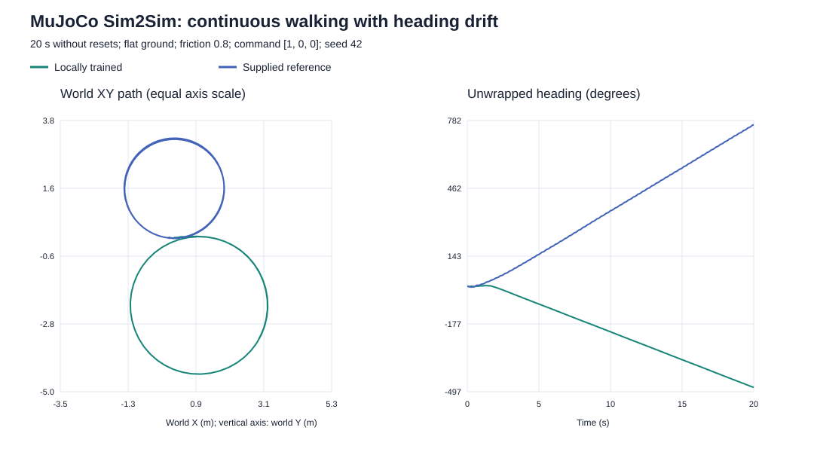

# Locomotion Baseline Reproduction

Recorded: 1 October 2026.

## Scope and attribution

This experiment reproduces the training workflow of
[yezzzzye/g1_walk_isaaclab_mujoco](https://github.com/yezzzzye/g1_walk_isaaclab_mujoco).
The robot model, task formulation, rewards and PPO configuration come from
that reference implementation. The local policy was trained from random
weights, not obtained by fine-tuning the supplied checkpoint.

This is a learning and reproduction experiment, not a claim of a new
locomotion algorithm. The external repository remains separate; its source,
robot assets and checkpoint files are not redistributed in this result package.
At packaging time, the reference checkout HEAD was
`19ce3c3561e3024055bf250ddd851b325175a7eb`, with a local viewer modification
and an untracked policy-export directory. This identifies the inspected
checkout, not a separately captured immutable training-time snapshot.

## Environment and training

| Item | Configuration |
| --- | --- |
| Hardware | NVIDIA GeForce RTX 4060 Laptop GPU, approximately 8 GB VRAM |
| Isaac Sim | 5.1.0.0 |
| IsaacLab checkout | v2.3.2 |
| PyTorch | 2.7.0+cu128 |
| rsl-rl-lib | 3.0.1 |
| Policy observation / action | 123D / 37D |
| Physics / policy timestep | 0.005 s / 0.02 s |
| Parallel environments | 4,096 |
| Rollout steps per environment | 24 |
| PPO updates | 1,500 |
| Collected transitions | 147,456,000 |
| Seed | 42 |
| Actor / critic hidden layers | 256, 128, 128; ELU |
| PPO epochs / minibatches | 5 / 4 |
| Initial learning rate | 0.001; adaptive schedule |
| Discount / GAE lambda | 0.99 / 0.95 |
| PPO clipping / desired KL | 0.2 / 0.01 |
| Entropy coefficient | 0.008 |
| Training duration | Approximately 54 minutes |
| Final local checkpoint | baseline_reproduction_1500/model_1499.pt |

The final training iteration reported a mean episode length of 992.28
policy steps and a timeout termination statistic of 0.9978.
These training statistics are not independent evaluation success rates.

## Matched evaluation

Both checkpoints were evaluated in the same local Isaac setup:
16 environments, seed 42, flat ground, static and dynamic friction 0.8,
1,000 policy steps (20 seconds), and command [1, 0, 0] for forward,
lateral and yaw velocity. Random-start yaw was not requested.

| Metric | Locally trained | Supplied reference |
| --- | ---: | ---: |
| Mean forward speed (m/s) | 0.8461 | 0.8302 |
| Forward-speed tracking RMSE (m/s) | 0.1845 | 0.1914 |
| Yaw-rate tracking RMSE (rad/s) | 0.1057 | 0.0893 |
| Mean forward distance (m) | 16.8182 | 16.3137 |
| Mean base height (m) | 0.6278 | 0.6145 |
| Mean tilt (degrees) | 4.1778 | 1.9613 |
| Reported fall/reset rate | 0 | 0 |


The local policy achieved comparable forward-speed tracking in this
single condition. Neither policy triggered a reported termination/reset
during the evaluation. This is not evidence of general superiority,
disturbance robustness, long-horizon reliability or real-robot transfer.

The reported lateral-drift metrics were 1.1821 m and 2.2029 m, while mean
absolute body-frame lateral speeds were 0.0240 and 0.0260 m/s. Coordinate
frames and aggregation need inspection before using drift as a headline
comparison. Baseline posture differences also require visual inspection.

## Reproduction commands

Run these commands in the external reference repository with its Isaac
environment and launcher variables configured. This repository does not
bundle that installation or the locally trained checkpoint.

```bash
bash run.sh isaac-train \
  --headless --num_envs 4096 --max_iters 1500 \
  --seed 42 --run_name baseline_reproduction_1500

bash run.sh isaac-eval \
  --headless --checkpoint /path/to/local/model_1499.pt \
  --num_envs 16 --max_steps 1000 --terrain plane \
  --static_friction 0.8 --dynamic_friction 0.8 \
  --command_x 1.0 --command_y 0.0 --command_yaw 0.0 --seed 42
```

Repeat evaluation using `isaac_sim/checkpoints/baseline/model_1499.pt`
to obtain the supplied-reference comparison.

Regenerate the figure from this repository:

```bash
python3 scripts/plot_locomotion_comparison.py
```

## Evidence and remaining work

The JSON files contain selected metrics transcribed from the evaluator's
terminal output, not complete raw logs. The CSV supplies the plotted values.
Checkpoint files and full training logs remain local.

Headless training and evaluation completed with exit code 0, but Isaac
still reported Vulkan GPU-foundation initialization errors. Graphical
Isaac support is not established by these successful runs.

## Continuous MuJoCo Sim2Sim check

Both exported actors were evaluated for 20 continuous seconds without resets,
using the bundled policy-aligned model, common metadata, 1 ms physics step,
20 ms policy interval, friction 0.8 and command [1, 0, 0].

| Metric | Locally trained | Supplied reference |
| --- | ---: | ---: |
| Completed simulated time (s) | 20 | 20 |
| Evaluator fall flag | 0 | 0 |
| Mean body-forward speed (m/s) | 0.9845 | 1.0662 |
| Body-forward speed RMSE (m/s) | 0.1471 | 0.2174 |
| World X net displacement (m) | 2.9134 | 1.2197 |
| Absolute world Y net displacement (m) | 3.2724 | 0.3505 |
| Yaw-rate RMSE (rad/s) | 0.4536 | 0.7488 |
| Mean tilt (degrees) | 11.2293 | 9.0824 |

The MuJoCo fall flag checks base height below 0.35 m at policy steps. It is
not the Isaac body-contact termination criterion or a general safety test.
The body-forward speed is measured in the moving body frame; world X net
displacement is not traveled path length. Turning can therefore produce
good body-speed tracking while making little progress along the commanded
initial world direction. Both policies exhibit this transfer limitation.

The viewer defaults to automatic resets every 10 seconds. Viewer observations
alone therefore cannot establish a continuous 20-second trajectory. These
numerical runs and the recording use the evaluator's no-reset rollout.



[Locally trained policy: full 20-second recording](../../media/videos/local_locomotion_sim2sim_20s.mp4).
The camera follows position with a fixed world azimuth; the video contains
no episode reset or selected success-only segment.

Metrics and trajectories are stored under `sim2sim/local` and
`sim2sim/reference`. They include actor and metadata SHA-256 hashes.
The recorder invokes the existing reference evaluator and samples a separate
MuJoCo data object for rendering; control and termination semantics are unchanged.

To reproduce, use the MuJoCo Python environment and choose a new output folder:

```bash
python scripts/record_locomotion_sim2sim.py \
  --reference-root /path/to/g1_walk_isaaclab_mujoco \
  --policy /path/to/exported/policy_actor.npz \
  --output-dir /path/to/new/output --label locally_trained_baseline --render
```

Rendering requires a working MuJoCo offscreen backend and FFmpeg. The output
directory must not already exist. Plot the published trajectories with
`python3 scripts/plot_sim2sim_drift.py`.

Next: inspect heading drift and simulator-interface differences before
claiming straight-line transfer or moving to robust fine-tuning and
hierarchical controller integration. No controller tuning was performed
to improve these recorded results.
