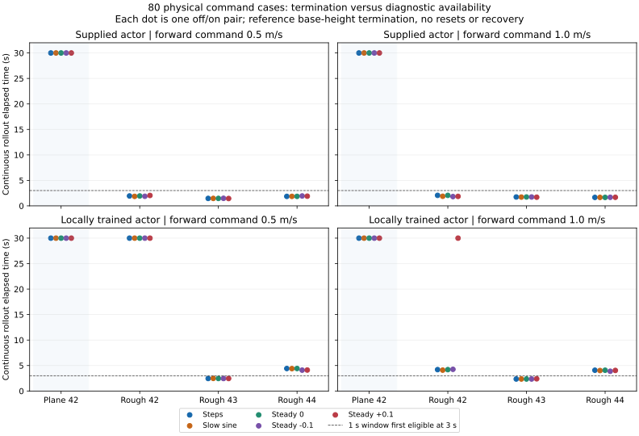

# Physical command plans and rough-terrain passive rollouts

Date: 2 October 2026. **80 paired cases / 160 MuJoCo rollouts** completed.
All off/on pairs pass exact non-interference checks. That PASS describes the
monitor, not successful locomotion. No controller switch, recovery, actor
training or PD tuning occurred.

## Actual execution matrix

Both supplied and locally trained exported actors use the reference 123D
observation / 37D action path. Each is evaluated with forward command 0.5
and 1.0 m/s and five yaw plans:

- Constant yaw 0, -0.1 and +0.1 rad/s.
- A slow sine, amplitude 0.2 rad/s, frequency 0.05 Hz.
- Steps: 0 until 8 s, +0.2 until 16 s, -0.2 until 24 s, then 0.

Each combination uses plane/seed42 and rough/seeds42,43,44 at friction 0.8,
1 ms physics and 20 ms policy updates, with a requested 30-second continuous
rollout. The reference base-height threshold <0.35 m is checked at policy
updates. Episodes terminate rather than reset. [protocol.json](protocol.json)
contains the matrix. Rough heightfield hashes differ across all three seeds;
plane seed is not treated as independent randomization.

The new recorder invokes reference `run_once`: observation assembly, actor,
action scaling, joint mapping, PD and termination remain reference code.
Only its command array is supplied by the explicit experiment plan at each
policy update; monitor outputs are never consulted. Final scalar command
fields in reference metrics describe the last applied command, not a
constant command for the whole rollout. Logged observations contain the
same command in dimensions 9:12 as the per-update command trace.

## Locomotion outcome

| Terrain | Actor | Cases | Completed 30 s | Evaluator fall flag | Elapsed range (s) |
| --- | --- | ---: | ---: | ---: | ---: |
| Plane | Supplied | 10 | 10 | 0 | 30–30 |
| Plane | Local | 10 | 10 | 0 | 30–30 |
| Rough | Supplied | 30 | 0 | 30 | 1.44–2.06 |
| Rough | Local | 30 | 6 | 24 | 2.36–30 |

The six rough local cases that do not cross the fall threshold are **nearly
stationary**: mean body-forward speeds are only 0.0053–0.0062 m/s. Forward
RMSE is about 0.496 m/s for 0.5 m/s commands, and 0.994 m/s for the surviving
1 m/s case. They must not be counted as successful rough-terrain walking.
The height-only fall flag does not establish upright posture or lack of
other body contact. These records do not establish physical robot transfer.

All plane cases survive but show poor yaw tracking: supplied yaw RMSE ranges
0.690–0.765 rad/s and local 0.384–0.519 rad/s. Surviving a rollout is separate
from commanded motion and heading quality. See [comparison.csv](comparison.csv).



Dots represent paired cases, not independent Bernoulli trials. Same seed,
initial state and plan prefix can produce identical trajectories, especially
when a fall occurs before a planned step. **Only 5 of 16 step-plan cases
execute all three transitions; 11 execute none**. Do not describe early
terminated cases as successful command-transition tests.

## Diagnostic availability and heading route proxy

[diagnostics.csv](diagnostics.csv) records actual command epochs, first legacy
candidate times, 1/2/4 s body-error windows and a separately defined heading
route proxy. Commands are held on [t_i,t_(i+1)); a new command at t_(i+1)
cannot affect the preceding interval. Body rate is linearly interpolated;
heading rate is constant per recorded interval. Both subtract the command
actually applied in that interval before integration. This prevents command
steps from contaminating past error integrals.

The reference heading is the integral of applied yaw commands, compared to
world ZYX Euler yaw derived from the saved wxyz quaternion. For the heading
route proxy, error is reanchored at 2 s, then |heading error|>0.35 rad for 1 s
in the same direction gives a proxy confirmation. This criterion was kept
separate from the rate-window threshold; it describes an operational
heading task, **not independently observed fault or safety ground truth**.
Body yaw commands and Euler heading rate remain distinct conventions; the
proxy cannot redefine the original reference policy task. No real false-
positive rate is claimed from these recordings.

With 2 s startup exclusion, a 1 s window is first eligible at 3 s (and requires
another 0.2 s dwell to enter). **40 fall cases terminate before any such
window is available**. All supplied rough cases are in that group. Absence
of a candidate there means unavailable evidence, not nominal tracking.

Every plane case has at least one 1 s window candidate and a confirmed
heading proxy. Of 30 local rough cases, 20 reach window eligibility but only
one has a body-yaw window candidate; five have a heading-route proxy
confirmation. In particular, none of the six 30 s rough cases has a yaw
window candidate, although five record proxy deviations. Small persistent
rate error can accumulate route error below a 0.3 rad/s mean-error threshold.
One steady +/-0.1 case ends with about +/-2.81 rad of reanchored heading error.
Thresholds remain exploratory and are not promoted based on this matrix.

Legacy scalar screens provide earlier *recorded evidence*: every supplied
rough case has a tilt candidate before termination, and every local rough
case has a forward-error candidate before its end. These screens also see
startup transients and lack calibrated normal/fault labels. Candidate counts
alone do not establish predictive accuracy, useful recovery lead time or a
safe fallback action. Full events and relative proxy timing are retained in
[analysis.json](analysis.json).

## Non-interference and pre-run provenance

[paired_verification.json](paired_verification.json) exposes all 80 paired
proofs. Every pair matches actions, sampled qpos/qvel, policy observations,
policy commands, complete initial integration state, per-physics-step
qpos/qvel/ctrl digest, trajectory bytes and all metrics except shadow flag.
Logged command rows exactly match policy input commands. Signal timestamps
match sampled states, and off runs contain no shadow events/signals.

[run_provenance.json](run_provenance.json) contains **before-first-action**
snapshots of reference XML/mesh/actor/metadata/source hashes, generated scene
XML hashes, initial `mjSTATE_INTEGRATION` hash, compiled model array/terrain
hashes and Python/NumPy/MuJoCo/thread configuration. Generated XML copies
normalize temporary include paths for stable snapshot comparison; the
executed scene is not rewritten. Complete initial state NPZ and generated
scene XML copies remain in the ignored local runs. Reference inputs are
checked unchanged at the end of each rollout.

Two further constant-command plane runs of original reference `run_once`
(with only read-only physics digest instrumentation) also match the new
recorder's metrics and digest exactly: [reference_control_check.json](reference_control_check.json).
These checks extend the old recorder's proofs; old result packages are
preserved. They do not resolve the separate historical reproduction issue.

## Reproduction

Choose new output directories from the repository root:

```bash
.venv/bin/python scripts/run_locomotion_command_matrix.py \
  --reference-root /home/omai/robotics/reference_projects/g1_walk_isaaclab_mujoco \
  --output-dir code/day9/g1_balance/checkpoints/locomotion_shadow/NEW_PHYSICAL_MATRIX \
  --summary-dir results/locomotion_shadow/NEW_PHYSICAL_MATRIX
.venv/bin/python scripts/analyze_physical_command_matrix.py \
  --source-dir code/day9/g1_balance/checkpoints/locomotion_shadow/NEW_PHYSICAL_MATRIX \
  --results-dir results/locomotion_shadow/NEW_PHYSICAL_MATRIX \
  --trace-dir code/day9/g1_balance/checkpoints/locomotion_shadow/NEW_PHYSICAL_ANALYSIS
/home/omai/robotics/.venv-g1/bin/python scripts/plot_physical_command_matrix.py \
  --results-dir results/locomotion_shadow/NEW_PHYSICAL_MATRIX
```

Current full runs: ignored `code/day9/g1_balance/checkpoints/locomotion_shadow/
20261002/physical_command_matrix/`. Offline detail CSVs are in the neighboring
`physical_command_analysis/`. Snapshots and policy weights are not distributed
in this public summary package. Runtime: Python 3.12.3, NumPy 2.5.3, MuJoCo
3.14.0, single OpenBLAS/OMP thread. Six new command timing/integration tests
and 26 existing related tests pass; command-integration tests also pass under
`python -O`.

## Next boundary

Do not solve missing/late evidence by granting window candidates switching
permission. Inspect rough-terrain early failure and surviving stagnation
under frozen controls, including contact/posture/torque traces, and define
separate fast tilt/height and sustained forward-progress diagnostics. Audit
initial terrain support and the reference simulator interface before changing
policy weights, rewards or PD gains. Retain the heading task as a distinct
tracking problem; slower rate bias can require an accumulated-heading signal
rather than a smaller arbitrary rate threshold. Any supervisor/fallback
remains separately calibrated and unauthorized in this result.
