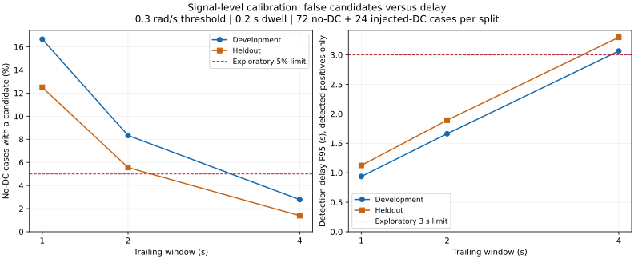

# Signal-level yaw diagnostic calibration

Date: 2 October 2026. **No parameter was selected for promotion.** None of
27 settings passed every predeclared development constraint. No supervisor,
fallback, actor update, recorder change or new G1 simulation was executed.

This extends the earlier six-trace analysis with known signal labels and
independent development/heldout seeds. It is not multi-seed G1/terrain
validation and does not establish a robot safety boundary.

## Cases and scoring

There are 192 reproducible 40-second signals at 50 Hz: 96 development cases
(seeds 1000–1011), and 96 heldout cases (seeds 10000–10011). Each split contains
12 examples from each of eight families: steady tracking, slow zero-DC
oscillation, slow command tracking, command steps, short residual pulse,
startup-only error, negative injected bias and positive injected bias.
That gives 72 no-injected-DC and 24 injected-DC cases per split.

Fast oscillations vary from 2.5 to 4.5 Hz; slow zero-DC oscillations vary from
0.08 to 0.65 Hz with 0.35–0.85 rad/s amplitude and random phase. Command ramps
and steps use a first-order response with a randomized 0.2–1.0 s time constant.
These are illustrative signal models, not G1 dynamics or measured normal
robot turns. No-DC labels describe absence of an injected persistent offset;
finite windows can still have legitimate nonzero mean. For positives, offsets
of +/-0.35–0.75 rad/s begin at known 8/12/16 s, with mixed slow/fast variation.
See the saved case manifest for every seed, label and generation parameter.

Tracking error subtracts the command **at each sample before window
integration**. This avoids artificial bias caused by subtracting the latest
command from a historical measured-rate average at a command change.

Scoring records no-DC cases with at least one candidate, fraction of eligible
no-DC time active, positive detection fraction, correct-direction detection
delay, pre-onset alarms and wrong-direction entries. A candidate already
active before bias onset cannot count as a new detection. P95 delay uses
*detected positives only*; misses are reported separately. These proportions
are finite signal-case results, not deployment false-alarm rates.

## Frozen development selection

The grid contains 1/2/4 s windows × 0.25/0.3/0.4 rad/s thresholds ×
0.2/0.5/1.0 s same-sign dwell (27 settings). Startup exclusion stays at 2 s.
Limits were declared before running the sweep:

- No-DC case alarm fraction <=5%.
- No-DC active-time fraction <=1%.
- Injected-bias detection fraction >=90%.
- Detected-positive delay P95 <=3 s.

These are exploratory engineering targets, not safety requirements or
validated deployment limits. Selection would minimize development delay P95
among settings satisfying all limits; it was frozen before heldout scoring.
**The development set produced no qualifying setting**, so selection remains
null. Settings that happen to pass heldout limits cannot be retroactively
selected using that holdout set.

## Predeclared baseline comparison

All rows below use 0.3 rad/s threshold and 0.2 s dwell. Every baseline detected
24/24 injected-bias cases in each split. Other settings and failures remain
in [development.csv](development.csv) and [heldout.csv](heldout.csv).

| Window | Split | No-DC cases with alarm | Eligible no-DC time active | Delay P95 (s) |
| --- | --- | ---: | ---: | ---: |
| 1 s | development | 16.67% | 7.12% | 0.937 |
| 2 s | development | 8.33% | 3.65% | 1.662 |
| 4 s | development | 2.78% | 1.12% | 3.065 |
| 1 s | heldout | 12.50% | 4.98% | 1.124 |
| 2 s | heldout | 5.56% | 2.39% | 1.892 |
| 4 s | heldout | 1.39% | 0.75% | 3.298 |



On heldout slow zero-DC cases specifically, the 1/2/4 s baselines alarmed in
8/12, 4/12 and 1/12 cases. Report these family-specific results alongside the
aggregate fractions: mixing easy controls into the denominator can obscure
a weak detector on slow oscillations. Heldout slow-command and command-step
cases produce no candidates for these three baselines. The 1 s baseline also
has one pre-onset alarm among 24 heldout positive cases.

Longer windows reduce oscillation-related candidates but delay recognition
of injected bias. Development's 4 s/0.4 rad/s/1 s dwell setting avoids all
72 no-DC alarms and detects all 24 positives, yet its delay P95 is 4.713 s,
above the exploratory 3 s target. Thus neither a single successful control
nor reduced false candidates justifies promotion.

This heldout set is small, generated from the same family distributions as
development, and lacks real command-transition/terrain data. There is no
claim of generalization to unmodeled frequencies, physical faults or G1
recovery. The existing six physically recorded trajectories remain biased
and are not relabeled as normal cases.

## Evidence and reproduction

[summary.json](summary.json) includes the case partitions, grid, limits,
frozen null selection and explicit absence of real switching authority.
[baseline_by_family.csv](baseline_by_family.csv) breaks down predeclared
baselines by family. [provenance.json](provenance.json) records Python/NumPy
versions and source/manifest hashes. Synthetic samples, generation labels
and all 5,184 per-case scores remain in the ignored local directory:

`code/day9/g1_balance/checkpoints/locomotion_shadow/20261002/yaw_calibration/`.

Source files and earlier result packages are preserved. To reproduce, choose
new output directories:

```bash
.venv/bin/python scripts/calibrate_locomotion_yaw.py \
  --output-dir results/locomotion_shadow/NEW_CALIBRATION \
  --case-output-dir code/day9/g1_balance/checkpoints/locomotion_shadow/NEW_CALIBRATION
/home/omai/robotics/.venv-g1/bin/python scripts/plot_yaw_calibration.py \
  --results-dir results/locomotion_shadow/NEW_CALIBRATION
.venv/bin/python tests/test_yaw_calibration.py
.venv/bin/python -O tests/test_yaw_calibration.py
```

Seven new tests cover command alignment, preexisting/wrong-direction alarms,
known onset scoring, false active time, deterministic generation and invalid
labels. Existing window and passive-monitor tests are also retained.

## Next physical experiment and interface boundary

The [supervisor observation contract and physical calibration protocol](../../../notes/locomotion_supervisor_interface.md)
specifies message provenance/eligibility, dynamic-command recording, seeded
rough-terrain variation, independent labels and fallback compatibility.
The reference terrain implementation uses seed for rough heightfields; merely
changing a plane seed does not create independent physical conditions.

Next collect actual command-schedule rollouts with the unchanged actor/PD
path and diagnostic logging, capturing complete model/scene/runtime hashes
before each run. Label tracking behavior independently before using it for
threshold calibration. Keep measured-rate offsets separate from physical
perturbations. If an online observer or new recorder is added, repeat exact
monitor-off/on tests for that implementation. Switching and recovery remain
unauthorized; the legacy 64D standing actor is not assumed to be a compatible
fallback for the 123D/37D walking path.
