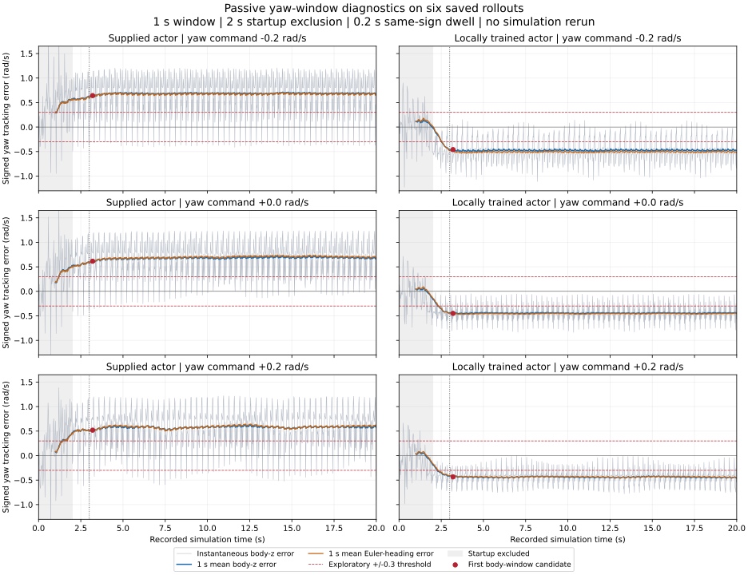

# Offline direction-bias window diagnostics

Recorded analysis: 2 October 2026. This work reads the six existing monitored
rollouts only: **zero simulator steps and no recorder/controller changes**.
The previous monitor-off/on proofs and historical comparison CSVs are preserved.

## Finding: the dwell-reset mechanism explains two missed candidates

Offline replay of `LocomotionShadow` reproduced **every saved event exactly**
for all six runs, including no yaw candidate for the local actor with yaw
commands 0 and +0.2 rad/s. In each of those two traces the longest sampled
post-startup continuous run of `abs(body_yaw_error) > 0.3 rad/s` was 0.16 s,
shorter than the required 0.2 s. Repeated returns to/below threshold reset the
pending timer. Their mean signed errors nevertheless remain negative.
This verifies the algorithmic explanation from the saved oscillating signal;
it does not establish a biomechanical cause for the oscillations.

## Exploratory trailing-window diagnostic

A complete trailing window computes signed mean yaw error and RMS error.
Body error is `body_angular_z - command_yaw`, matching the reference evaluator.
Between samples, the error is linearly interpolated; first and second moments
are integrated exactly over elapsed time, including fractional window edges.
RMSE measures magnitude, while the signed mean separates directional bias from
zero-mean oscillation. RMSE alone is not used to assert directional bias.

The primary exploratory configuration is a **1 s window, 0.3 rad/s absolute
signed-mean threshold, 0.2 s same-sign dwell, and 2 s startup exclusion**.
Only windows wholly after startup are eligible: the first ends at 3 s.
A threshold crossing or direction change clears/restarts dwell. Incomplete
windows remain unavailable, never treated as zero. Computation is causal:
no centered differences, future samples, or simulation access.

| Actor | Yaw command (rad/s) | Mean body error after 2 s (rad/s) | Mean Euler-heading error after 2 s (rad/s) | Old yaw candidate entries, full run | Longest old exceedance after 2 s (s) | New window entries | First new entry (s) |
| --- | ---: | ---: | ---: | ---: | ---: | ---: | ---: |
| Supplied | -0.2000 | +0.6801 | +0.6703 | 56 | 0.28 | 1 | 3.20 |
| Supplied | +0.0000 | +0.6762 | +0.6924 | 6 | 0.42 | 1 | 3.20 |
| Supplied | +0.2000 | +0.5760 | +0.5836 | 37 | 0.28 | 1 | 3.20 |
| Local | -0.2000 | -0.4737 | -0.5066 | 59 | 0.22 | 1 | 3.20 |
| Local | +0.0000 | -0.4430 | -0.4542 | 0 | 0.16 | 1 | 3.20 |
| Local | +0.2000 | -0.4382 | -0.4337 | 0 | 0.16 | 1 | 3.20 |

All six primary candidates enter at 3.2 s and remain active to the end (16.8 s).
That timing follows the configured warm-up, full-window requirement and dwell;
it is **not a measured real-anomaly onset-to-detection delay**. Real traces
have no independent anomaly labels, and every run here has substantial
persistent tracking bias. Candidate-count reduction is not a calibrated
precision/recall improvement. [metrics.csv](metrics.csv) separates startup
[0,2] s from the later interval and retains body RMSE and heading displacement.



The gray curves are instantaneous body-z errors, blue curves are 1 s signed
body-error means, and orange curves use Euler-heading change. The dotted
vertical line marks 3 s eligibility. Gray shading marks startup; early window
values are visible for diagnosis but cannot trigger. A common plotted y-range
emphasizes post-startup behavior; some startup peaks extend beyond that range.

## Body angular z and Euler heading are distinct

The saved state layout is 44 qpos followed by 43 qvel. The reference XML places
the pelvis free joint first with identity fixed orientation, so `qpos[3:7]`
contains its body-to-world quaternion in w,x,y,z order. Quaternions are
normalized and world ZYX Euler yaw is computed by
`atan2(2*(w*z+x*y), 1-2*(y*y+z*z))`, then unwrapped across +/-pi.
This agrees with the existing recorder's pelvis yaw to within 4.1e-15 rad.
The largest adjacent heading change is 0.0285 rad; the largest absolute pitch
is 10.45 degrees, away from the Euler pitch singularity in these samples.

Euler-heading window mean rate is `(heading(t)-heading(t-W))/W`. Heading RMSE
uses squared error of the backward interval rates, constant within each
recorded 20 ms interval. The constant yaw command is subtracted for diagnostic
comparison. This is a heading diagnostic, not a replacement for the policy's
body-angular-velocity input or the reference tracking metric. Sampling cannot
exclude unobserved rotations between samples in arbitrary future rollouts.

The two signals agree on bias direction in these runs, but their numerical
means differ. For local yaw=0 the post-startup body error is -0.4430 rad/s,
while Euler-heading error is -0.4542 rad/s. For local yaw=+0.2 they are
-0.4382 and -0.4337 rad/s. These are errors relative to the command, not the
raw body angular-z values quoted in the earlier full-run summary.

## False-alarm controls and latency tradeoff

Eight deterministic synthetic signals were assessed with the same timing
rules, including controls intended to have no persistent direction bias.
These are engineering controls, not an estimate of deployment false-alarm rate.

| Synthetic error signal | 1 s / 0.3 rad/s candidate entries | Interpretation |
| --- | ---: | --- |
| Zero error | 0 | No baseline alarm |
| Zero-mean 4 Hz oscillation, amplitude 0.8 rad/s | 0 | Mean cancels while RMSE exceeds 0.3 |
| Zero-mean 2.7 Hz oscillation, amplitude 0.8 rad/s | 0 | Off-period control also stays quiet |
| Startup error only, ending at 2 s | 0 | Full post-startup windows exclude it |
| A 0.3 s post-startup pulse, amplitude 0.8 rad/s | 0 | This short pulse is attenuated |
| -0.4 rad/s plus 4 Hz oscillation | 1 | Old sampled exceedance runs remain below 0.2 s; window finds bias |
| Bias begins at 8 s, -0.4 plus 4 Hz oscillation | 1 | Candidate at 8.96 s, known-onset delay 0.96 s |
| Zero-mean 0.5 Hz slow oscillation, amplitude 0.8 rad/s | 18 | False alarms for the intended persistent-bias label |

Slow oscillation has genuine local mean over short windows but zero long-run
mean; **the 1 s diagnostic cannot distinguish it from persistent bias**.
For that same control a 2 s window records zero candidate entries. For the
known-onset biased control, detection moves from 8.96 s to 9.70 s. A 0.5 s
window reacts at 8.58 s but still triggers on the slow zero-mean control.
The [parameter sweep](parameter_sweep.csv) covers 0.5/1/2 s windows,
0.2/0.3/0.4 rad/s thresholds and both rate definitions on all six traces
(108 combinations). All configurations find a candidate in all six biased
traces. The [synthetic controls](synthetic_controls.csv) cover 72 combinations.
These thresholds are exploratory, not safety boundaries.

Use 1 s as an explanatory sensitive diagnostic and examine 2 s as a slower
corroborating diagnostic. Neither is ready to command a fallback. Further
calibration needs normal low-frequency turning and command transitions,
multiple seeds/speeds/terrain conditions, and independently labeled bias
onsets. Evaluate false candidate durations as well as event counts and
latency; do not tune exclusively on these six already biased traces.

## Evidence and reproducibility

[summary.json](summary.json) contains signed phase statistics, events,
source rollout configurations, heading cross-checks and the explicit offline
scope. [provenance.json](provenance.json) records analysis runtime, every
source artifact hash, actor/metadata hashes, current reference HEAD, and
current XML plus all 49 referenced mesh hashes. **Current model hashes are
not retroactively captured original model hashes**. They support future
comparisons; the old/new reproduction discrepancy remains unresolved.
Every source artifact was checked unchanged after analysis, and all six
saved monitor-off/on pairs were reverified without rerunning physics.

Detailed window CSVs and exceedance-run timings remain ignored locally in
`code/day9/g1_balance/checkpoints/locomotion_shadow/20261002/yaw_window_analysis/`.
No weights, models or meshes are copied into this result package.

From the repository root, choose new output directories:

```bash
.venv/bin/python scripts/analyze_locomotion_yaw_windows.py \
  --source-dir code/day9/g1_balance/checkpoints/locomotion_shadow/20261002/turning_validation \
  --reference-root /home/omai/robotics/reference_projects/g1_walk_isaaclab_mujoco \
  --output-dir results/locomotion_shadow/NEW_YAW_ANALYSIS \
  --trace-output-dir code/day9/g1_balance/checkpoints/locomotion_shadow/NEW_YAW_TRACES

/home/omai/robotics/.venv-g1/bin/python scripts/plot_locomotion_yaw_windows.py \
  --results-dir results/locomotion_shadow/NEW_YAW_ANALYSIS \
  --trace-dir code/day9/g1_balance/checkpoints/locomotion_shadow/NEW_YAW_TRACES

.venv/bin/python tests/test_yaw_window.py
.venv/bin/python -O tests/test_yaw_window.py
```

Analysis uses Python 3.12.3 / NumPy 2.5.3. The plotting environment supplies
Matplotlib 3.11.2. Original recordings retain their MuJoCo 3.14.0 runtime in
`source_rollout_config`; this analysis does not run MuJoCo. Ten new analytic,
causality and failure-case tests pass, also under `-O`. Three existing monitor
tests and six existing evidence-verification tests still pass.

## Next calibration and supervisor boundary

Keep diagnostics offline until normal slow-turning cases and labeled bias
experiments establish their intended meaning. A future observation message
should carry timestamp, complete-window eligibility, signal definition,
signed mean, RMSE, window length, candidate onset/direction, input provenance
and reset identifier. Separate diagnostic candidates from any authorized
supervisor decision. Supervisor/fallback interfaces remain a later task;
this change adds no automatic switch, recovery action, PD retuning or training.
If these diagnostics are later connected to the recorder, repeat exact
monitor-off/on trajectory checks for that changed recorder.
