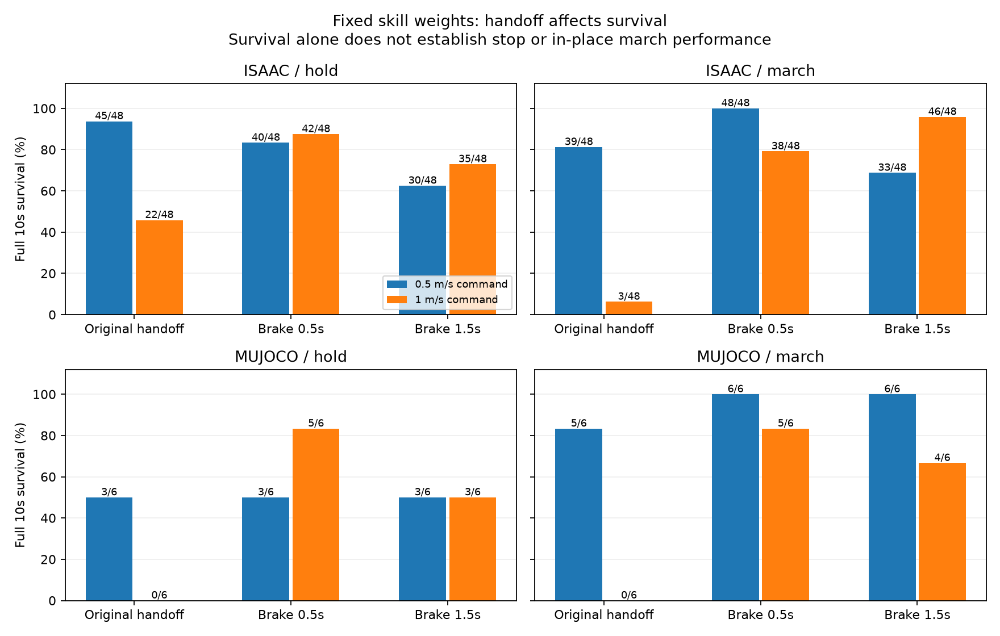

# 技能本身与行走交接分离诊断（2026-10-03）

**完成684案例：Isaac608、MuJoCo76；固定首轮两份权重和1499，不追加训练。交接方式显著影响存活，但尚无整段停车/原地踏步任务通过。**

## 技能能力证据

- Isaac默认零速度冷启动：停车16/16存活10s并持续停稳，最后2s双脚接触比例全部1.0。位移约4.45cm；启动阶段航向最大偏差约0.292rad（16.7°）超过原0.2rad标准，因此整体仍0/16。
- Isaac踏步冷启动16/16存活，最后2s水平速度RMS0.0417–0.0472m/s。2–10s每脚有8–9段持续≥0.06s的抬脚（踝体高度≥0.080m），接触与0.9s周期相位符合度94.4%–97.8%；有明确节律技能，但整段位移/航向未达到原地指标。
- MuJoCo冷启动两种技能各2/2存活，但停车尾段速度RMS约0.426m/s；踏步约0.232/0.491m/s。无1499行走交接也存在运动偏差，不能把全部问题归为高速交接。停车的两个相位输入不使用，因此两次是相同确定性轨迹，不是独立试验。

## 交接对照：完整10秒存活，不代表任务验收通过

| 引擎 | 技能 | 前序速度指令 | 原交接 | 先减速0.5s | 先减速1.5s |
|---|---|---:|---:|---:|---:|
| isaac | hold | 0.5m/s | 45/48 | 40/48 | 30/48 |
| isaac | hold | 1.0m/s | 22/48 | 42/48 | 35/48 |
| isaac | march | 0.5m/s | 39/48 | 48/48 | 33/48 |
| isaac | march | 1.0m/s | 3/48 | 38/48 | 46/48 |
| mujoco | hold | 0.5m/s | 3/6 | 3/6 | 3/6 |
| mujoco | hold | 1.0m/s | 0/6 | 5/6 | 3/6 |
| mujoco | march | 0.5m/s | 5/6 | 6/6 | 6/6 |
| mujoco | march | 1.0m/s | 0/6 | 5/6 | 4/6 |

- 高速Mu接手实际速度中位数0.976→0.593→0.278m/s；较慢并不总是更好。Isaac低速停车存活45→40→30/48，说明固定减速时长不能直接变成默认控制策略。
- 两个Isaac踏步、一个Mu停车案例满足从实际交接开始计算的原完整标准，但从最初减速决策开始计位移，分别约0.557/0.577m和0.616m，超过0.2m/0.5m限制。**整段决策到完成的通过数仍为0/684**，没有隐藏制动距离来宣布成功。

## 协议与解释限制

- Static：默认重置姿态且速度为0，候选t=0直接动作，不使用0.5s混合；这是冷启动，不是已经稳定站姿的测试。原plan的blend_s=.5适用于行走交接，static例外在此明确。
- 三个交接分支共享减速开始前的状态和动作；Ramp由1499执行vx/yaw线性降指令，然后换候选，并保留原0.5s动作混合。不是要求在一个20ms策略步内停止，也没有改变策略/物理步长。
- 每个实际交接后观察10s。另记录decision_metrics涵盖减速过程。尾段指标只在完整存活案例间比较；失败/自动重置后的数据不计能力分数，动作重建也只核验首次存活段。
- 原指标不改：停车持续停稳、净位移≤0.5m；踏步每脚≥5次离地/落地且抬脚≥0.025m、净位移≤0.2m；两者航向最大偏差≤0.2rad、roll/pitch≤20°、完整10s。探索性标准不是安全边界或申请项目的官方要求。
- .5m/s在首轮训练的.3–.8范围内，1m/s是范围外压力。Seed42；Isaac平行环境的时刻/相位变化并非独立seed。Mu几何接触与Isaac>1N力接触定义不同；两引擎结果不作为同一种随机重复。
- Ramp同时改变速度、接手姿态、支撑阶段与策略历史，证据证明交接协议影响结果，尚不能隔离速度为唯一原因。锚点xy/heading只用于首轮奖励，未输入策略；本轮也未添加位置/航向反馈。

## 证据核验

- 动作首次运行重建461793行，观测123D/125D相位、前动作反馈、网络输出和连续混合均通过；Torch/NumPy最大输出差8.58e-06。
- 432组减速前配对状态/动作逐数组完全一致；36组direct回放与原首轮trace逐数组完全一致。684条案例指标重算及接触/抬脚/通过判定核验通过（验证脚本在python -O下执行）。
- 3项协议测试与4项适配测试正常及-O模式通过；相关脚本编译通过。运行环境包版本、模型/策略/源码/协议哈希、114份trace的SHA及每案例JSON保留。原始trace位于Git忽略目录，公开目录不复制大轨迹或权重。

## 下一步

优先覆盖真实1499接手状态和支撑相位，分别评估制动与进入技能后的保持；不要仅追加原来的自策略前序训练。Mu冷启动偏差需另查迁移一致性和技能持续控制。现有低速能力不应被全零通过率抹去，但没有把任何候选注册为watchdog停车/fallback。未测试返回行走、多seed或扰动，不宣称完整技能库可用。

## 复现与文件

`run_plan.json`记录实际四个命令；`source/scripts/run_skill_handoff_diagnostic.py --output <新的目录>`可在相同环境执行有限矩阵，已有目录拒绝覆盖。依赖现有本地快照/两份权重/Isaac安装。`analyze_skill_handoff.py`支持分引擎/技能核验；`cases.csv`、`summary.json`汇总；`motion_diagnostics.json`补充持续抬脚和相位指标。`runtime_*.json`、`trace_hashes.json`和`SHA256SUMS`提供来源。

**没有改默认控制器、重新训练、commit或push。**
