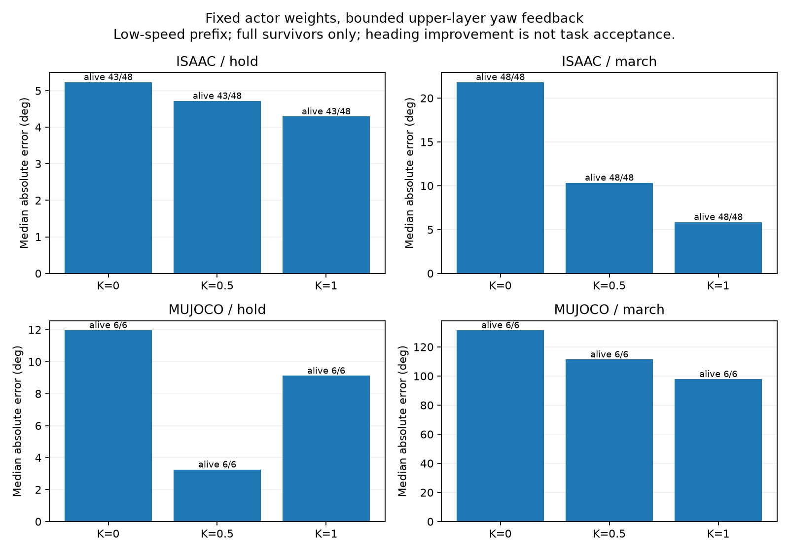

# 固定技能actor＋上层航向反馈对照（2026-10-03）

完成324案例（Isaac288、Mu36）。反馈仅改变候选输入的yaw速度指令；1499与最新两份技能model499固定。没有训练、默认控制器替换、watchdog权限变更或commit/push。

## 完整结果

| 引擎／技能 | 增益 | 完整10s存活 | 原全指标通过 | 最终航向误差中位数 | 后8s净位移中位数 |
|---|---:|---:|---:|---:|---:|
| isaac/hold | 0.0 | 43/48 | 31/48 | 5.23° | 3.78cm |
| isaac/hold | 0.5 | 43/48 | 31/48 | 4.72° | 3.96cm |
| isaac/hold | 1.0 | 43/48 | 27/48 | 4.29° | 4.01cm |
| isaac/march | 0.0 | 48/48 | 0/48 | 21.82° | 3.43cm |
| isaac/march | 0.5 | 48/48 | 0/48 | 10.34° | 3.27cm |
| isaac/march | 1.0 | 48/48 | 0/48 | 5.86° | 3.26cm |
| mujoco/hold | 0.0 | 6/6 | 0/6 | 11.97° | 181.14cm |
| mujoco/hold | 0.5 | 6/6 | 0/6 | 3.25° | 182.17cm |
| mujoco/hold | 1.0 | 6/6 | 0/6 | 9.12° | 177.65cm |
| mujoco/march | 0.0 | 6/6 | 0/6 | 131.45° | 53.75cm |
| mujoco/march | 0.5 | 6/6 | 0/6 | 111.35° | 60.56cm |
| mujoco/march | 1.0 | 6/6 | 0/6 | 97.86° | 58.64cm |

全部中位数仅在完整存活案例计算。最终航向误差是相对交接时航向的绝对误差，不是过程中的最大偏差；不能用最终值代替原最大航向偏差≤0.2rad指标。

## 结论与采用决定

- Isaac踏步最终航向误差中位数21.82°→10.34°→5.86°，后8s净位移约3.43→3.27→3.26cm，三组均48/48存活且有原接触/抬脚指标。存在上层反馈收益，但整段位移和早期航向 excursion仍阻碍原地任务验收，三组均0/48完整通过。
- Isaac停车K0/K.5各31/48通过；K1下降到27/48，持续停稳42→41→37/43存活案例。微小最终航向改善不能抵消稳定保持退化。不把K1当作统一增益。
- Mu停车三组都6/6存活但0/6停稳；尾速中位数约.256/.256/.277m/s。Mu踏步最终误差约131.45→111.35→97.86°仍大，后8s位移.537→.606→.586m，没有完整通过。较小航向误差不代表解决迁移偏差。
- 只保留诊断候选，不更改默认方案。说明低层固定时上层command反馈能改善部分技能的航向，同时存在技能差异和跨仿真限制。不是统一actor或神经网络过渡层，也不是可靠fallback。

## 协议与数据

- vx前序仅0.5m/s，yaw=-.2/0/+.2；Isaac每命令16交接时间/相位，Mu两个时间/相位；seed42，平行副本不是独立seed，未测试高速。
- 目标是实际交接时Euler航向；交接后2s才启动wrap(target-current)×K反馈，±.2rad/s限幅，.5s smoothstep渐入。原交接.5s动作混合保留。限幅不是经验证的安全边界。
- 当前技能训练的stationary yaw命令是0，非零yaw属于新的输入条件；该结果不能代替针对command跟踪的训练。反馈开始2s也不是已校准的接手门槛。
- 原10s/位移/航向/倾斜/停稳/接触抬脚指标不变；固定2s分段只诊断，不更换验收。只核验首次有效运行，跌倒后自动reset数据不计能力、也不要求与旧reset后控制路径一致。

- 独立-O核验248557动作行、324指标；216组直到反馈开始前的配对前缀一致；18组K0与上一轮对应trace的首次有效数组一致（Mu整个终止前trace，Isaac每trace16环境）。最大actor输出重建差7.63e-06。
- 4项反馈边界测试正常/O通过，相关脚本编译通过；输入SHA、54份原始traceSHA与运行协议保留。原始大数据在本地Git忽略heading_feedback_diagnostic目录，未上传GitHub。

源、指标、每案例JSON见verification_*、cases.csv、summary.json、source；复现实际命令在run_plan.json。原实验未覆盖返回行走、H↔M、perception dropout停车、恢复或扰动。后续应按技能分别校准过渡/持续控制，独立验证序列交接，不盲目追加PPO或宣布完整技能库可用。
