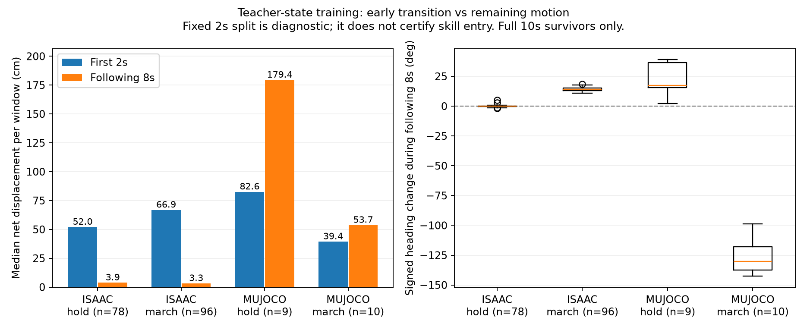

# 真实1499接手状态微调完成（2026-10-03）

两个独立技能各4096环境×500更新、导出、Isaac96/Mu12评估均完成；当前无训练运行，无自动追加训练。三份policy仍独立，1499与首轮权重不变。

| 技能/引擎 | 完整10s存活首轮→本轮 | 满足全部原指标首轮→本轮 |
|---|---:|---:|
| 停车/Isaac | 67→78 /96 | 0→31 /96 |
| 停车/MuJoCo | 3→9 /12 | 0→0 /12 |
| 踏步/Isaac | 42→96 /96 | 0→0 /96 |
| 踏步/MuJoCo | 5→10 /12 | 0→0 /12 |

Isaac停车31通过都来自0.5m/s前序；低速存活45→43/48，高速22→35/48，不是所有条件单调改善。Mu停车存活改善但本轮持续停稳0/12，首轮曾有2例；仍需跨仿真控制检查，不能称综合改善。

Isaac踏步96/96均有原接触/抬脚指标，尾段速度RMS约0.018–0.023m/s，全部存活，但净位移0.211–0.958m全部超过0.2m；只有1例最大航向偏差≤0.2rad。Mu踏步10个存活案例均有接触/抬脚，但净位移0.241–1.003m均超限。技能运动与交接存活有所改善，完整原地任务未验收。

以上结果已通过保存数据独立重建：216案例、162113首次运行动作行，原指标与通过判定一致。本轮10个队列产物和14个输入SHA核验通过。无技能注册到watchdog或fallback，无commit/push。独立核验和分段诊断现已完成；返回行走、条件门控、失联停车与恢复仍待验证。

详情见summary.json与hold/march；README_STARTUP.md保留启动记录。原始trace及模型在本地忽略teacher_handoff_round目录。

## 下一步已完成：交接与持续运动的分段诊断

| 存活案例 | 前2s净位移中位数 | 后8s净位移中位数 | 后8s带符号航向变化中位数 |
|---|---:|---:|---:|
| Isaac停车（78） | 52.0cm | 3.85cm | -0.08° |
| Isaac踏步（96） | 66.9cm | 3.29cm | +14.2° |
| Mu停车（9） | 82.6cm | 179.4cm | +17.4° |
| Mu踏步（10） | 39.4cm | 53.7cm | -130.3° |

2s仅是固定诊断窗口，不表示技能已经稳定进入。净位移为每段首尾距离，不能把两段标量直接相加；累计路程可相加并已核验。只比较完整10s存活案例，平行环境不是独立seed。

结论：Isaac停车/踏步位置偏差主要发生在初期，但踏步持续航向漂移仍存在；Mu持续移动明显，不能只改交接或放宽总位移指标。保留原完整任务结论，同时单独报告进入后的能力。暂不自动追加训练、发布或注册恢复控制器。

[证据链索引](research_evidence_index.md)列出17个主要数据节点；[库存](evidence_inventory.json)已核查203个本地技能原始资产。大轨迹与模型仍在本地Git忽略目录，未上传；历史快照缺口明确保留。
